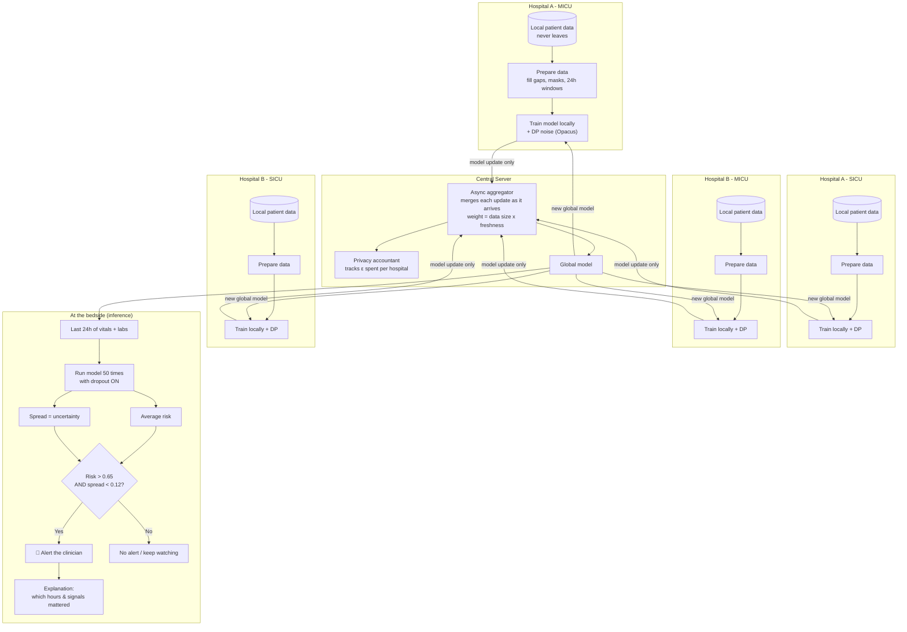
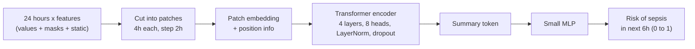
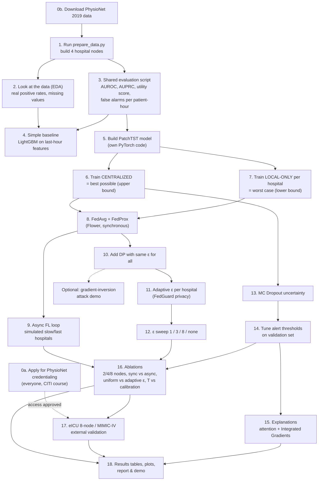

# FedGuard: Project Plan

**Privacy-Preserving Federated Learning for ICU Sepsis / Deterioration Early Warning**
Team: Shrikar Ramesh · Suhruth R Bharadwaj · Tejas Amarnath · Triambak TS

---

## 1. The project in simple words

- Several hospitals want to build one good model that warns doctors **6 hours before** a patient gets sepsis.
- They are **not allowed to share patient data**.
- So each hospital trains the model **on its own computer** and sends only the **model updates** (numbers, not patients) to a central server.
- The server **mixes the updates** into one better global model and sends it back. This repeats in rounds.
- To stop anyone from reverse-engineering patients from those updates, we add **differential privacy (DP)**, which means carefully chosen random noise.
- Hospitals are slow or fast at different times, so the server **does not wait for everyone** (asynchronous).
- At the bedside, the model runs **50 times with dropout on** (MC Dropout). If it is **high-risk AND confident**, it raises an alert. If it is unsure, it stays quiet, which means fewer false alarms.

---

## 2. Key decisions (changes from the synopsis)

| Topic | Synopsis said | We will do | Why |
|---|---|---|---|
| Main dataset | MIMIC-IV | **PhysioNet/CinC 2019 Sepsis** (open, download today). MIMIC-IV / eICU come later once access is approved | MIMIC needs credentialing (CITI course + approval), which can take days to weeks |
| Hospital nodes | 4 care units of one hospital | **2 real hospital systems × 2 units = 4 nodes** (A-MICU, A-SICU, B-MICU, B-SICU) | Real non-IID data from genuinely different hospitals |
| Time resolution | 1-minute, 720 × 5 | **1-hour, 24-hour lookback** | Charted ICU vitals are roughly hourly |
| Inputs | 5 vitals | **Vitals + labs + "was it measured" masks + age/sex/ICU time** | Sepsis-3 depends on labs; missingness is a signal |
| Model | HuggingFace PatchTST | **Own PatchTST in PyTorch with LayerNorm** | HF version uses BatchNorm, which breaks DP (Opacus) |
| Async FL | Flower | **Own simulated-clock async loop** for experiments; **Flower** for sync baselines + live demo | Flower is synchronous out of the box |
| Privacy budget | ε ≤ 8 *per round* | **Total ε per client over all training**, δ = 1e-5, sweep ε ∈ {1, 3, 8, ∞} | Per-round ε adds up over rounds and is misleading |
| Targets | AUROC > 0.85, AUPRC > 0.68, 18% positives | **Measure real prevalence first** (expect about 2% of hours). Headline: *"FedGuard recovers X% of the gap between local-only and centralized at ε ≤ 8"* | AUPRC must be judged against prevalence |
| Alert rule | std < 0.12 (doc) / variance < 0.12 (slides) | **Pick one (std)** and tune thresholds on validation data only | Consistency + no test leakage |

---

## 3. Datasets

| When | Dataset | Access | Use |
|---|---|---|---|
| **Today** | PhysioNet/CinC 2019 Sepsis (40,336 patients, 2 hospitals, hourly) | Open, no login | Primary: 4 federated nodes |
| Today | eICU-CRD Demo (about 2,500 stays, 20 hospitals) | Open | Prototype many-hospital split |
| Apply today | eICU-CRD full (208 hospitals) | Credentialed | 8-node ablation with real hospitals |
| Apply today | MIMIC-IV v3.1 | Credentialed | External validation |
| Optional | HiRID (high-resolution, Bern) | Credentialed | High-frequency extension |

**Download now:**
```bash
aws s3 sync --no-sign-request s3://physionet-open/challenge-2019/1.0.0/training/ ./training
# or
wget -r -N -c -np -nH --cut-dirs=3 https://physionet.org/files/challenge-2019/1.0.0/training/
python prepare_data.py --raw ./training --out ./data
```

Also get the challenge paper and the official scoring code from `github.com/physionetchallenges`.

---

## 4. System architecture



### The model (inside each hospital)



---

## 5. What to do, in order (with dependencies)

Arrows mean "must be done before".



**Things that can run in parallel:**
- Credentialing (step 0a) runs in the background the whole time.
- Once the PatchTST model works (step 5), three tracks can go at once: **federated learning** (8–9), **privacy** (10–12), and **uncertainty** (13–15).
- The LightGBM baseline (step 4) doesn't block anything; it's a sanity check.

---

## 6. Timeline

| When | Goal | Done when… |
|---|---|---|
| **Day 0 (today)** | Data ready | 4 node files exist, positive rates known, everyone applied for credentialing |
| **Week 1** | Baselines | Centralized + local-only AUROC/AUPRC numbers in W&B |
| **Week 2** | Federated core | FedAvg, FedProx and async FL all run end to end |
| **Week 3** | Privacy | DP runs at ε = 1, 3, 8; adaptive ε compared with uniform |
| **Week 4** | Smart alerts | False-alarm reduction and calibration plots ready |
| **Weeks 5–6** | Ablations + write-up | All tables with 3 seeds (mean ± std), report + demo ready |

---

## 7. Who does what (suggested)

| Person | Owns |
|---|---|
| **Tejas** | Data pipeline, EDA, eICU/MIMIC preprocessing later |
| **Triambak** | PatchTST model, MC Dropout, explanations |
| **Shrikar** | Federated learning (sync + async), DP / privacy accounting |
| **Suhruth** | Baselines, shared evaluation script, W&B dashboards, report |

Rule: **everyone uses the same evaluation script and the same data splits** so every number is comparable.

---

## 8. Experiments to report

| # | Method | What it shows |
|---|---|---|
| 1 | Centralized (no privacy) | Best-case upper bound |
| 2 | Local-only (each hospital alone) | Why collaboration is needed |
| 3 | FedAvg (no DP) | Basic federated learning |
| 4 | FedProx (no DP) | Handling different hospital data |
| 5 | FedAvg + uniform DP | Cost of privacy |
| 6 | **FedGuard** (async + adaptive DP + MC Dropout alerts) | Our system |

**Metrics:** AUROC, AUPRC (always shown next to prevalence), PhysioNet utility score, false alerts per patient-hour, sensitivity, calibration error (ECE), total ε per hospital, communication cost per round.

---

## 9. Hardware & software

- **Hardware:** RTX 4050 laptop is enough for development and most runs (the model is small); use a bigger GPU only for the full sweep grid.
- **Software:** Python 3.10+, PyTorch, Opacus, Flower (`flwr`), scikit-learn, LightGBM, Captum, Weights & Biases, pandas / numpy, matplotlib.

---

## 10. Risks & backups

| Risk | Backup |
|---|---|
| MIMIC / eICU access delayed | Whole project runs on PhysioNet 2019; credentialed data is a bonus |
| DP destroys accuracy | Report the trade-off curve honestly; try larger batches, fewer rounds, ε = 8 |
| Async is unstable | Cap staleness; fall back to FedAsync-style mixing with small α |
| MC Dropout thresholds overfit | Tune on validation only; report on untouched test set |
| Opacus errors with the model | Use `ModuleValidator.fix()`; no BatchNorm; use Opacus's DP attention layer |
