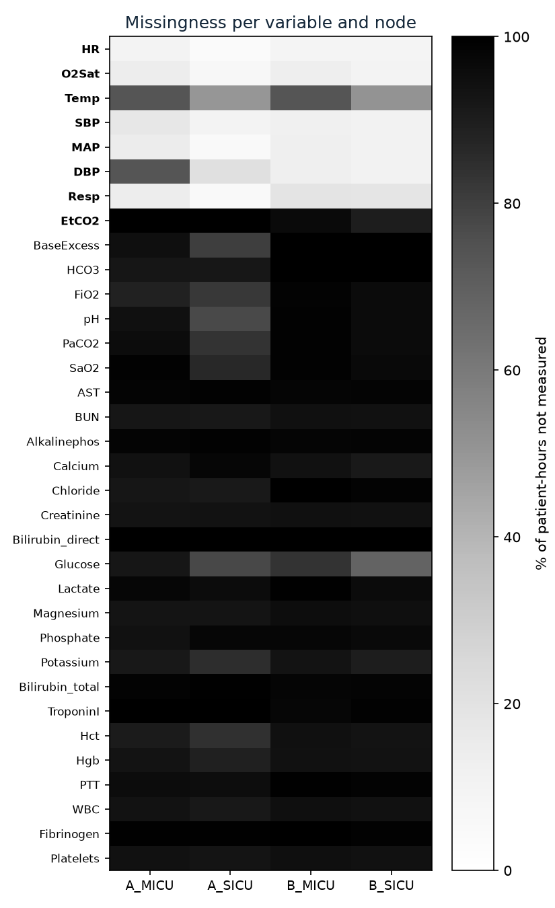
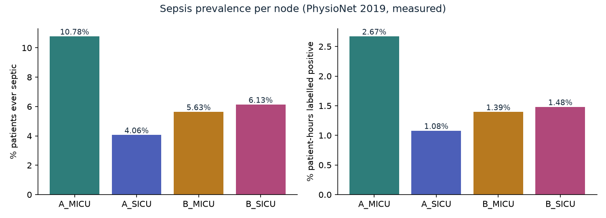
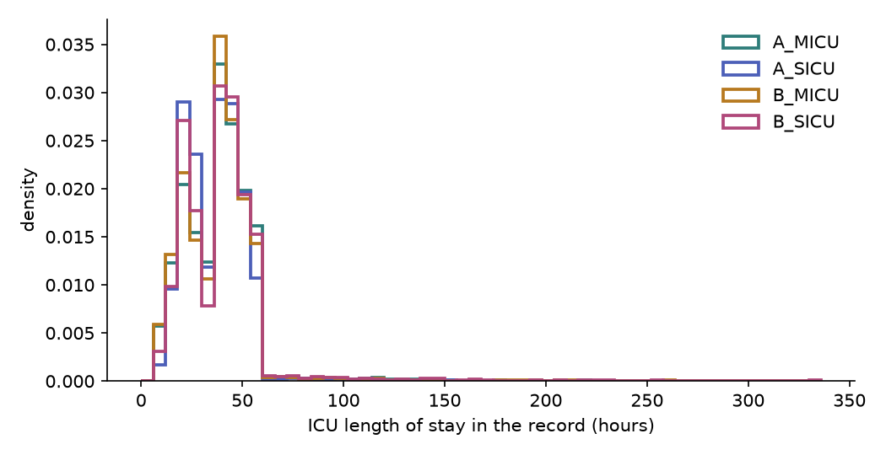
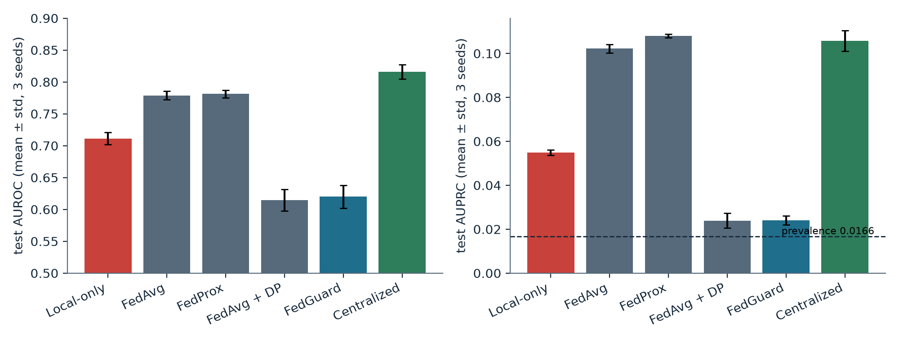
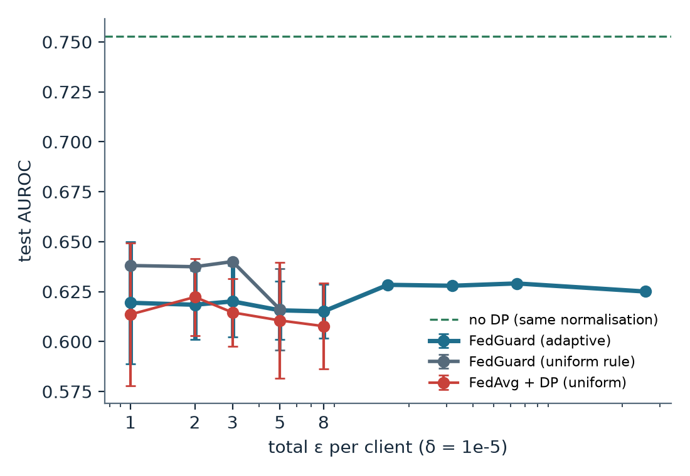
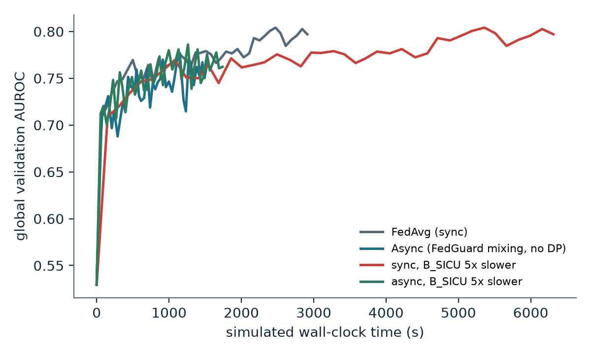
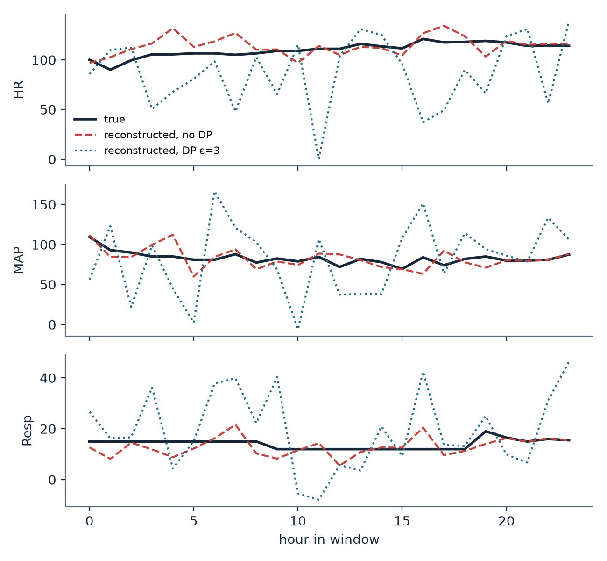
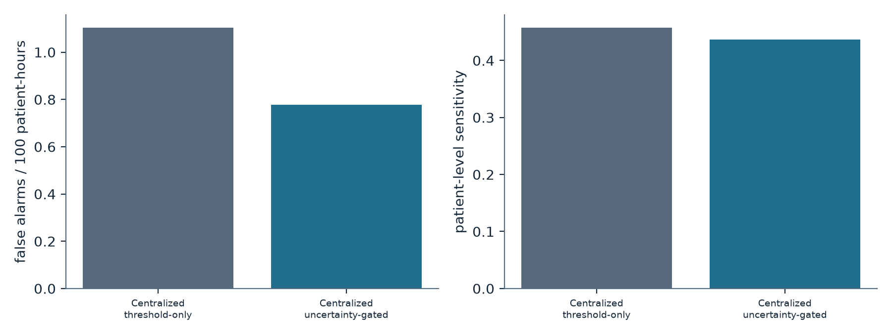
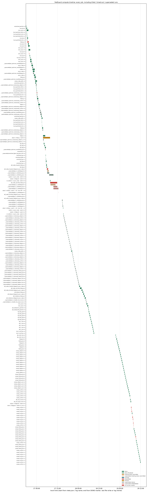

# FedGuard: master project report

**Privacy-Preserving Federated Learning for Real-Time ICU Sepsis Early Warning**

Final-year B.E. project, Computer Science and Engineering (AI & ML)

| | |
|---|---|
| Team | Shrikar Ramesh, Suhruth R Bharadwaj, Tejas Amarnath, Triambak TS |
| Guide | *not recorded in any project file* |
| Institution | *not recorded in any project file* |
| Repository | https://github.com/ShrikarRamesh/FedGuard |
| Report date | 30 September 2026 |
| Code state described | the commit that contains this report (see `git log`); experiments finished 2026-09-29 11:59 |

<sub>Sources: team from `README.md` and `FedGuard_Plan.md`; repository from `git remote -v`; experiment end time from `docs/proof_of_compute.md`.</sub>

**How to read this report.** Every number comes from a file in the repository or in the run directory `runs/`, and the file is named in small text under each table. Where no record exists, the report says **not run** or **not recorded**. Nothing has been estimated or filled in. Failures, bugs and superseded runs are included on purpose, because they are part of the record.

---

## Table of contents

1. [Abbreviations and symbols](#1-abbreviations-and-symbols)
2. [Executive summary](#2-executive-summary)
3. [Project overview](#3-project-overview)
4. [Data](#4-data)
5. [System design](#5-system-design)
6. [Design decisions D1 to D39](#6-design-decisions-d1-to-d39)
7. [Bugs and problems, and how each was fixed](#7-bugs-and-problems-and-how-each-was-fixed)
8. [Results](#8-results)
9. [Proof of compute](#9-proof-of-compute)
10. [Reproducibility](#10-reproducibility)
11. [Limitations and future work](#11-limitations-and-future-work)
12. [Appendix A: every run](#appendix-a-every-run)
13. [Appendix B: decisions log reference](#appendix-b-decisions-log-reference)
14. [Appendix C: superseded runs and why](#appendix-c-superseded-runs-and-why)
15. [Appendix D: file index of the repository](#appendix-d-file-index-of-the-repository)
16. [Appendix E: missing records and inconsistencies found while writing this report](#appendix-e-missing-records-and-inconsistencies-found-while-writing-this-report)

---

## 1. Abbreviations and symbols

### 1.1 Abbreviations

| Abbreviation | Full form | Plain meaning |
|---|---|---|
| AdamW | Adam with decoupled Weight decay | A popular optimiser that adapts the step size of every model weight separately. |
| AI | Artificial Intelligence | Computer systems that perform tasks that normally need human judgement. |
| AMP | Automatic Mixed Precision | Training with lower-precision numbers for speed; not used here because it conflicts with Opacus. |
| API | Application Programming Interface | The set of functions a library offers to other code. |
| AST | Aspartate aminotransferase | A liver blood test; one of the 34 input variables. |
| AUPRC | Area Under the Precision–Recall Curve | How well a model ranks true cases above others when positives are rare; a random model scores the positive rate. |
| AUROC | Area Under the Receiver Operating Characteristic curve | Probability that the model gives a random sick hour a higher risk than a random healthy hour; 0.5 is chance, 1.0 is perfect. |
| B.E. | Bachelor of Engineering | The degree this project is part of. |
| BCE | Binary Cross-Entropy | The standard loss function for yes/no prediction. |
| BSD-2 | Berkeley Software Distribution 2-clause licence | The permissive licence of the official challenge scoring code vendored in the repo. |
| BUN | Blood Urea Nitrogen | A kidney blood test; an input variable. |
| CC-BY 4.0 | Creative Commons Attribution 4.0 | The open licence of the PhysioNet 2019 dataset. |
| CI | Confidence Interval | A range that likely contains the true value (here 95%, by patient-level bootstrap). |
| CITI | Collaborative Institutional Training Initiative | The human-subjects research course PhysioNet requires before granting access to credentialed data such as MIMIC-IV. |
| CLI | Command-Line Interface | The `fedguard` terminal command through which everything is run. |
| CLS | Classification token | An extra learned vector a transformer uses to summarise a sequence. |
| CPU | Central Processing Unit | The computer's main processor. |
| CSE | Computer Science and Engineering | The department of the degree. |
| CSV | Comma-Separated Values | A plain-text table file format. |
| CUDA | Compute Unified Device Architecture | NVIDIA's software layer for running computations on the GPU. |
| DBP | Diastolic Blood Pressure | A vital sign; an input variable. |
| DLG / iDLG | Deep Leakage from Gradients / improved DLG | Attacks that rebuild training data from a shared gradient; iDLG also infers the label. |
| DP | Differential Privacy | A mathematical guarantee that the output barely changes whether or not any one person's data was used. |
| DP-AdamBC | DP-Adam with Bias Correction | A published fix for Adam under DP (Tang et al.); cited to explain the D38 artefact. |
| DP-SGD | Differentially Private Stochastic Gradient Descent | Training in which each example's gradient is clipped and random noise is added, giving DP. |
| DPDP | Digital Personal Data Protection (Act, India, 2023) | India's data-protection law. **Listed on request; it does not appear in any project file.** |
| ECE | Expected Calibration Error | Average gap between predicted risk and observed frequency; 0 means perfectly calibrated (15 bins here). |
| EDA | Exploratory Data Analysis | First descriptive look at the data (counts, missingness, prevalence). |
| EHR | Electronic Health Record | A patient's digital medical record. **Listed on request; it does not appear in any project file.** |
| eICU-CRD | eICU Collaborative Research Database | A credentialed multi-hospital ICU dataset; only an adapter stub exists, it was never downloaded. |
| EtCO2 | End-tidal carbon dioxide | A breathing measurement; an input variable. |
| FedAvg | Federated Averaging | Server averages the hospitals' models, weighted by data size, once per round. |
| FedProx | Federated Proximal | FedAvg plus a penalty that keeps each hospital's model close to the global one. |
| FiO2 | Fraction of inspired oxygen | Oxygen concentration given to the patient; an input variable. |
| FL | Federated Learning | Training one model across several data holders without moving their data. |
| GPU | Graphics Processing Unit | The processor used for fast neural-network training (NVIDIA RTX 4050 Laptop, 6 GB). |
| GRU | Gated Recurrent Unit | A recurrent neural network for sequences; used as a baseline. |
| HCO3 | Bicarbonate | A blood test; an input variable. |
| HiRID | High time-Resolution ICU Dataset | A credentialed dataset named in the plan as optional; not used. |
| HIPAA | Health Insurance Portability and Accountability Act (USA) | US health-privacy law. **Listed on request; it does not appear in any project file.** |
| HR | Heart Rate | A vital sign; an input variable. |
| HTML | HyperText Markup Language | The format of the stand-alone browser demo page. |
| ICU | Intensive Care Unit | Hospital ward for critically ill patients. |
| ICULOS | ICU Length Of Stay | The hour counter since ICU admission, a column of the dataset. |
| IG | Integrated Gradients | An explanation method that credits each input feature for a prediction. |
| IID / non-IID | Independent and Identically Distributed | Whether all hospitals' data look alike (IID) or differ (non-IID). The data here are non-IID. |
| JSON / JSONL | JavaScript Object Notation / JSON Lines | Structured text file formats; JSONL has one record per line (used for event logs). |
| LAN | Local Area Network | A local network, for the planned multi-laptop demo. |
| LightGBM | Light Gradient-Boosting Machine | A fast decision-tree ensemble library; used as a baseline. |
| LOS | Length Of Stay | How many hours a patient spent in the ICU. |
| LR | Logistic Regression | A simple linear baseline model. (Lower-case "lr" means learning rate.) |
| MAP | Mean Arterial Pressure | A vital sign; an input variable. |
| MC Dropout | Monte Carlo Dropout | Running the model many times with random dropout switched on; the spread of answers measures uncertainty. |
| MD5 | Message-Digest 5 | A file fingerprint used to verify downloads. |
| MICU | Medical Intensive Care Unit | ICU for medical (non-surgical) patients. |
| MIMIC-IV | Medical Information Mart for Intensive Care IV | A credentialed ICU dataset; only an adapter stub exists, it was never downloaded. |
| ML | Machine Learning | Learning patterns from data. |
| MLP | Multi-Layer Perceptron | A small stack of fully connected layers (the model's prediction head). |
| MSE | Mean Squared Error | Average squared difference; used to score the attack's reconstruction. |
| NaN | Not a Number | Marker for a missing value. |
| OFL | SIL Open Font License | Licence of the bundled font. |
| OOM | Out Of Memory | A crash or stall because memory ran out. |
| PatchTST | Patch Time-Series Transformer | A transformer that reads a time series in short overlapping "patches"; FedGuard's main model. |
| PID | Process IDentifier | The number the operating system gives a running program. |
| PTT | Partial Thromboplastin Time | A blood-clotting test; an input variable. |
| RAM | Random-Access Memory | The computer's working memory. |
| RDP | Rényi Differential Privacy | A way of adding up privacy loss over many training steps precisely (the Opacus accountant). |
| RNG | Random Number Generator | Source of randomness, seeded for reproducibility. |
| SaO2 | Arterial oxygen saturation | A blood-gas measurement; an input variable. |
| SBP | Systolic Blood Pressure | A vital sign; an input variable. |
| SGD | Stochastic Gradient Descent | The basic optimiser: step against the gradient of a random batch. |
| SHA-256 | Secure Hash Algorithm, 256-bit | A file fingerprint used to verify backups. |
| SICU | Surgical Intensive Care Unit | ICU for surgical patients. |
| TLS | Transport Layer Security | Network encryption; disabled only for the closed-LAN demo. |
| UNK | Unknown (unit) | Patients whose ICU unit is not recorded in the data. |
| USA | United States of America | |
| VRAM | Video RAM | The GPU's own memory (6,141 MiB here). |
| W&B | Weights & Biases | An optional online experiment tracker (not required). |
| WBC | White Blood Cell count | A blood test; an input variable. |
| WDDM | Windows Display Driver Model | The Windows GPU driver model, which can page GPU memory to system memory when it fills up. |
| YAML | YAML Ain't Markup Language | The human-readable format of all configuration files. |

Flower terms used below: **SuperLink** is Flower's server process and **SuperNode** is a client (hospital) process. **Opacus** is the PyTorch library that implements DP-SGD. **Captum** is the PyTorch library used for Integrated Gradients.

### 1.2 Symbols

| Symbol | Meaning |
|---|---|
| ε (epsilon) | Privacy loss. Smaller means stronger privacy. Always the **total** over all of a client's training. |
| δ (delta) | Small probability that the ε guarantee fails; fixed at 10⁻⁵ (< 1 / number of training patients). |
| σ (sigma) | Noise multiplier: standard deviation of the added Gaussian noise, in units of C. |
| C | Clipping norm: the maximum length any one patient's gradient may have (C = 1). |
| q | Sampling rate: the chance each patient is picked for a DP step. |
| n_i, N | Size of client i, and the total size of all clients. |
| α₀, a_i | Async mixing strength, and the weight of client i's update when it is merged. |
| λ, τ | Staleness decay rate, and staleness (how many global versions old an update is). |
| μ | FedProx penalty strength. |
| T | Number of MC-Dropout passes. |
| τ_r, τ_σ | Alert thresholds: minimum risk, and maximum uncertainty (standard deviation). |

---

## 2. Executive summary

**The problem.** Sepsis is a life-threatening reaction to infection, and warning ICU doctors a few hours early saves lives. Good warning models need data from many hospitals, but hospitals cannot share patient records. FedGuard tests whether hospitals can train one model together without sharing data (federated learning), while giving each patient a formal privacy guarantee (differential privacy) and raising alerts only when the model is confident.

**What was built.** A complete, tested Python system on the open PhysioNet/CinC 2019 sepsis dataset (40,336 ICU stays from two hospital systems, split into four hospital-unit "nodes"):

- a data pipeline with patient-level splits and strictly causal inputs;
- an own transformer model (PatchTST) that works with DP;
- a simulated-clock federated engine: synchronous FedAvg and FedProx, and an asynchronous, staleness-weighted "FedGuard" server;
- a Flower implementation, cross-checked against the engine;
- patient-level DP-SGD with exact privacy accounting and per-hospital budget rules;
- uncertainty-gated alerts (MC Dropout), calibration, and explanations (Integrated Gradients);
- a gradient-inversion privacy attack;
- a resumable experiment runner, reporting, a proof-of-compute appendix, and a Streamlit demo app.

In three days of compute (26–29 September 2026) the project ran 225 jobs using 82.1 GPU job-hours, including every failed and superseded run.

**Three main findings.**

1. **Federation works without privacy noise.** FedAvg (test AUROC 0.779 ± 0.007) and FedProx (0.781 ± 0.006) close about 65–67% of the gap between hospitals training alone (0.711 ± 0.010) and pooling all data centrally (0.816 ± 0.011).
2. **Formal patient-level privacy costs a lot at this model size, and the cost barely depends on ε.** With DP at ε ≤ 3 per hospital, FedGuard reaches 0.620 ± 0.018 and FedAvg + DP 0.615 ± 0.017, below the no-sharing baseline. From ε = 1 to ε = 256 the DP models stay between about 0.61 and 0.63, while the same pipeline without noise reaches 0.753. The most likely reason is that the noise, which grows with the square root of the ~595,000 model parameters, swamps the learning signal at every tested ε. A time-boxed test with a smaller model did not help.
3. **DP does stop the privacy attack.** Without DP, a gradient-inversion attack recovered the label of 100% of attacked windows and partly rebuilt the vital signs (correlation 0.35). With DP at any tested ε (1, 3, 8), reconstruction fell to zero correlation and label guessing to chance (50%).

**Main limitations.**

- The DP models are too weak to raise useful alerts (sensitivity about 1%). Uncertainty-gated alerting was therefore demonstrated on models without DP, where it cut false alarms by 14–29% for about 2 points of sensitivity (seed 0).
- Only one open dataset with two hospital systems was used. The credentialed datasets were never accessed.
- The ablations use one seed each.
- The final DP recipe (a σ-scaled learning rate) was introduced late, after two recipe bugs were found and fixed (D34, D38).

<sub>Sources: `results/tables/main.md`, `results/tables/privacy.md`, `results/report_summary.json`, `results/attack/attack.json`, `runs/async_nodp/*/alerts.json`, `runs/centralized_patchtst/20260926-174650_0/alerts.json`, `docs/proof_of_compute.md`, `docs/data.md`.</sub>

---

## 3. Project overview

### 3.1 The problem

Sepsis is the body's extreme response to an infection. The PhysioNet/CinC 2019 Challenge asks for a model that, every hour, predicts from the data so far whether a patient will meet the Sepsis-3 criteria within about the next 6 hours. The dataset's labels are already shifted 6 hours early, so predicting the hourly label is 6-hour-ahead prediction (`docs/data.md`).

Three obstacles make this hard in practice:

- **Data cannot be pooled.** Hospitals are not allowed to share patient records. **Federated learning (FL)** solves this by sending model updates, not data, to a server.
- **Model updates can leak data.** Shared gradients can be inverted to reconstruct patients. **Differential privacy (DP)** adds calibrated noise so that no single patient's influence can be detected.
- **False alarms cause alarm fatigue.** An alert should fire only when the model is both worried and confident. **MC Dropout** measures the model's uncertainty.

### 3.2 Objectives

From `FedGuard_Plan.md` and `CLAUDE_CODE_BUILD_PROMPT.md`:

1. Build a reproducible data pipeline on PhysioNet 2019 with four realistic, non-IID hospital nodes.
2. Build a DP-compatible time-series model (own PatchTST with LayerNorm, no BatchNorm).
3. Compare Local-only, FedAvg, FedProx, FedAvg + DP, FedGuard (asynchronous + adaptive patient-level DP) and Centralized training, with 3 seeds each.
4. Report privacy exactly: total ε per client from the RDP accountant, and a privacy–utility sweep.
5. Build uncertainty-gated alerting, calibration and explanations, with all thresholds tuned on validation data only.
6. Demonstrate the privacy threat with a gradient-inversion attack, with and without DP.
7. Provide a Flower deployment, a demo app, and complete proof of the computation done.

The plan's headline target was "FedGuard recovers X% of the gap between local-only and centralized at ε ≤ 8" (`FedGuard_Plan.md`, section 2). The measured answer is in section 8.1.

### 3.3 Team and guide

| Role | Name |
|---|---|
| Team members | Shrikar Ramesh, Suhruth R Bharadwaj, Tejas Amarnath, Triambak TS |
| Project guide | **not recorded** in any repository file |

<sub>Source: `README.md`, `FedGuard_Plan.md`.</sub>

### 3.4 Timeline of the whole project

Reconstructed from git commit times (IST, +05:30) and run timestamps. Everything was built and run between 26 and 30 September 2026. No earlier activity (synopsis, proposal) is recorded in the repository.

| When | What happened | Evidence |
|---|---|---|
| 26 Sep 17:14 | M0: package scaffold, configs, CLI, run provenance, 8 tests | commit `9326b40`; `PROGRESS.md` |
| 26 Sep 17:35 | M1: data download (40,336 files), processing, splits, EDA | commit `744c232`; `PROGRESS.md` |
| 26 Sep 17:46 | First real training run (centralized PatchTST, seed 0) | `docs/proof_of_compute.md` |
| 26 Sep 18:08–22:54 | DP and async tuning runs; main runs begin | `docs/proof_of_compute.md` |
| 26 Sep 18:56 | M2–M9 code: models, FL engine, Flower, DP, alerts, explanations, attack, report, export, app (86 tests) | commit `fa9f3c4` |
| 26 Sep 22:45 | DP recipe selected (D28), α₀ = 4 chosen (D20), alert grid fix (D29), GPU job cap | commit `2b45bf6` |
| 27 Sep 05:13 | DP diagnosis tooling, watchdog, LightGBM early-stopping fix (D33) | commit `b50e975` |
| 27 Sep 05:44 | **Optimizer-state bug fixed (D34)**; all DP runs to be redone | commit `39e2b98` |
| 27 Sep 06:03 | Post-fix DP runs start | `docs/proof_of_compute.md` |
| 27 Sep 10:36 | Batched gradient-inversion attack; watchdog heartbeat; atomic GPU slot lock | commit `25b4da5` |
| 27 Sep 12:42–12:49 | Proof-of-compute generator, GPU logger, backup script | commits `248ccbb`, `e6e6e31`, `9764a7d` |
| 27 Sep 14:50 | `fl finalize` for runs killed during evaluation (D37) | commit `520e894` |
| 27 Sep 15:16–15:22 | First complete 6-method table (later superseded) and full attack run | commits `9f0cdd9`, `85f2caa` |
| 27 Sep 15:29 – 28 Sep 06:03 | ε sweep, large-ε extension and ablations (one GPU job at a time) | `runs/_queue_logs/`; `docs/proof_of_compute.md` |
| 28 Sep 00:05–07:28 | D38 investigation: the ε curve is inverted; SGD test; σ-scaled learning-rate rule; floor test | commits `5db5d10` to `17291cd` |
| 28 Sep 21:29 | Model choice rule pre-registered, then the small-model test run | commit `8221878`; `runs/dp_small_rule/` |
| 28 Sep 21:57 | σ-scaled rule adopted; old DP runs archived; final DP rerun starts (deadline 29 Sep 12:00) | commit `6ba3fa0` |
| 29 Sep 06:28–09:35 | 13 rerun jobs fail (12 out of memory, 1 wrongly killed); queue ends 40 ok / 13 failed | `docs/decisions.md` D39 |
| 29 Sep 09:36–12:00 | Failed jobs retried until the deadline | `runs/_queue_logs/`; `docs/proof_of_compute.md` |
| 29 Sep 18:55 | Final `fedguard report` and `fedguard proof` | commit `a8eeefb` |
| 29 Sep 23:28 | Final verified backup of `runs/` (1,046 MiB, 3,735 files) | `OneDrive\FedGuard_backups\MANIFEST.json` |
| 30 Sep | Proof-of-compute double-counting bug fixed (section 7); this report | this commit |

<sub>Sources: `git log`; `docs/proof_of_compute.md`; `docs/decisions.md`; backup `MANIFEST.json`.</sub>

Milestones M0 and M1 are documented in `PROGRESS.md`. **M2–M10 were never written into `PROGRESS.md`**, which still lists them as "not started" (see Appendix E). Their completion is shown by commit `fa9f3c4` (code for M2–M9) and by the runs in section 8.

---

## 4. Data

### 4.1 The dataset

**PhysioNet/CinC Challenge 2019: Early Prediction of Sepsis from Clinical Data**, v1.0.0, open access under CC-BY 4.0 (Reyna et al., *Crit Care Med* 2020). The data were downloaded from the public S3 bucket without a login. The organisers' hidden test set (hospital C) is not public and was not used.

Each ICU stay is one file with one row per hour: 34 time-varying variables (8 vital signs, 26 laboratory tests), then Age, Gender, Unit1 (MICU), Unit2 (SICU), HospAdmTime (hours from hospital to ICU admission), ICULOS (the ICU hour counter) and SepsisLabel. A value is NaN when it was not measured that hour.

### 4.2 Verification

| Check | Result |
|---|---|
| Files downloaded | training_setA **20,336**, training_setB **20,000** (40,336 patients); each checked against its S3 MD5 |
| Patient-hours | **1,552,210** |
| Processing time | 22 s (`fedguard data process`) |
| Unit conflicts (both unit flags set) | 0 |
| Non-monotone labels (1 then 0) | 0 of 2,932 septic patients |
| Non-consecutive ICULOS | 0 |
| Patients positive from their first row ("onset-ambiguous") | 426 |

<sub>Source: `PROGRESS.md` (M1), `docs/data.md`.</sub>

**Label meaning.** The organisers shifted the label 6 hours early: for septic patients `SepsisLabel[t] = 1` for t ≥ t_sepsis − 6. FedGuard never shifts it again. The onset hour used for alerts is the first positive row plus 6.

### 4.3 Nodes (the four "hospitals")

Hospital A = training_setA and B = training_setB. The ICU unit comes from the Unit1/Unit2 flags. Patients with neither flag are "UNK".

| Stratum | Patients | Septic patients | Septic rate | Patient-hours | Positive-hour rate | Median LOS (h) |
|---|---:|---:|---:|---:|---:|---:|
| A_MICU | 5,344 | 576 | 10.78% | 204,894 | 2.67% | 39 |
| A_SICU | 5,470 | 222 | 4.06% | 199,156 | 1.08% | 37 |
| A_UNK | 9,522 | 992 | 10.42% | 386,165 | 2.46% | 39 |
| B_MICU | 6,923 | 390 | 5.63% | 262,007 | 1.39% | 38 |
| B_SICU | 6,982 | 428 | 6.13% | 274,193 | 1.48% | 39 |
| B_UNK | 6,095 | 324 | 5.32% | 225,795 | 1.36% | 38 |
| **All** | **40,336** | **2,932** | **7.27%** | **1,552,210** | **1.80%** | 38 |

<sub>Source: `docs/data.md`; `results/eda/summary_by_stratum.csv`.</sub>

**Main 4-node federation** (partition `unit`, `unk_policy: exclude`): 24,719 patients, 1,616 septic (6.54%), 940,250 patient-hours, positive-hour rate **1.63%**. UNK patients are 38.7% of the data (15,617 patients). They are excluded from the main federation because a unit cannot be invented for them (D13). Centralized training uses the same 24,719 patients, so the comparison is like-for-like.

### 4.4 Splits

Patients, never rows, are split 70/15/15 into train/validation/test. The split is stratified on "ever septic" within each hospital × unit stratum, with a separate random generator per stratum (seed 42), so it does not depend on file order (D4).

| Node | Train patients | Validation patients | Test patients | Onset-ambiguous |
|---|---:|---:|---:|---:|
| A_MICU | 3,740 | 801 | 803 | 89 |
| A_SICU | 3,828 | 820 | 822 | 22 |
| B_MICU | 4,846 | 1,037 | 1,040 | 100 |
| B_SICU | 4,886 | 1,047 | 1,049 | 65 |
| **All 4** | **17,300** | **3,705** | **3,714** | **276** |

<sub>Source: `results/eda/eda_summary.json` (key `main`).</sub>

The global test set has 245 septic patients and 140,254 patient-hours. The fraction of positive test windows is 0.0166, which is the chance level for AUPRC in every results table.

<sub>Sources: `runs/async_nodp/20260926-210356_0/alerts.json` (n_septic, patient_hours); `results/summary.csv` (prevalence).</sub>

### 4.5 Features and windows

The model input has **107 channels** per hour (D6):

- **34 values.** Forward-filled only within the patient and never backwards. Standardised with training-patient statistics: per client for local and federated runs, pooled for centralized, and fixed public reference values for DP runs (D3, D5, D15).
- **34 masks.** 1 if the variable was measured that hour.
- **34 deltas.** Hours since the last measurement, log-scaled and capped at 48 h.
- **5 static channels.** Age, Gender, log ICULOS, HospAdmTime, and an HospAdmTime-observed flag, all with fixed scaling.

One sample is one patient-hour, with a **24-hour lookback window** that only reads rows at or before that hour. Windows are left-padded with zeros and never cross into another patient.

### 4.6 Heterogeneity findings

- **Label skew.** The septic-patient rate ranges from 4.1% (A_SICU) to 10.8% (A_MICU).
- **Measurement-practice skew.** The same variable is missing at very different rates by site (fraction of patient-hours missing):

| Variable | A_MICU | A_SICU | B_MICU | B_SICU |
|---|---:|---:|---:|---:|
| DBP | 73.7% | 21.4% | 12.5% | 10.2% |
| Temp | 73.6% | 49.7% | 73.6% | 50.9% |
| HCO3 | 92.4% | 91.9% | 99.9% | 99.7% |
| BaseExcess | 94.6% | 80.4% | 99.9% | 99.6% |

<sub>Source: `docs/data.md`; `results/eda/missingness.csv`.</sub>

- **Stay length** is similar across nodes: median 37–39 h, 90th percentile 52–56 h.
- **Prevalence claim corrected.** The original synopsis claimed "18% positives". The measured value is 1.80% of hours overall and 1.63% in the main federation (`PROGRESS.md`).







**What this means.** The four nodes differ in how often they measure things and how common sepsis is. The masks alone largely identify the site. This is realistic, "non-IID" data, which is exactly the situation in which federated learning is hard.

---

## 5. System design

### 5.1 Architecture

```text
             PhysioNet 2019 files (40,336 stays)
                          |
     fedguard data download / process / eda (MD5-verified, causal ffill,
     patient-level splits, 107-channel hourly features, 24 h windows)
                          |
     +---------+---------+---------+---------+
     | A_MICU  | A_SICU  | B_MICU  | B_SICU  |   4 clients = hospital x ICU unit
     +---------+---------+---------+---------+
        local training: PatchTST (+ patient-level DP-SGD for DP runs)
                          | model updates only (never data)
                          v
     Server: sync FedAvg / FedProx, or async FedGuard (staleness-weighted merge)
       - in-house simulated-clock engine (experiments)
       - Flower 1.38 ServerApp/ClientApp (deployment and cross-check)
                          |
                          v
     Global model -> MC Dropout (T = 50) -> risk mean + uncertainty
       -> alert policy (risk > tau_r AND std < tau_sigma, tuned on validation)
       -> Integrated Gradients + attention rollout (explanations)
       -> gradient-inversion attack (threat demonstration)
                          |
     fedguard report / proof / export -> results/, docs/, Streamlit app
```

### 5.2 The model: PatchTST

A **transformer** is a neural network that lets every part of the input "attend" to every other part. **PatchTST** cuts the 24-hour window into overlapping patches: 4 hours long, one every 2 hours, giving 11 patches. It embeds each patch, runs a transformer encoder over the patches, and a small MLP head outputs the sepsis probability.

| Setting | Value |
|---|---|
| Patch length / stride | 4 h / 2 h (11 patches) |
| Model width d_model | 128 |
| Encoder layers / attention heads | 4 / 8 |
| Feed-forward width d_ff | 256 |
| Dropout | 0.2 |
| Head hidden size | 64 |
| Parameters | **594,945** |
| Normalisation | LayerNorm (BatchNorm would break DP) |

<sub>Sources: `configs/model/patchtst.yaml`; parameter count from `loops.build_model` (matches `docs/decisions.md` D27).</sub>

It is FedGuard's own implementation rather than the HuggingFace one, because that uses BatchNorm, which is incompatible with DP-SGD. Attention is hand-written with linear Q/K/V layers, which keeps it Opacus-compatible and exposes the attention weights (D10). Positional embeddings are indexed with a batch-expanded id tensor, to avoid an Opacus crash (D1). The smaller model tested for DP (d_model 64, 2 layers, 4 heads, d_ff 128, head 32) has 97,409 parameters.

Baselines: a GRU (recurrent network), logistic regression and LightGBM (trees) on hand-crafted features. All are trained centrally.

### 5.3 The federated engine

Experiments use an **event-driven simulated clock**. Each client's training time is simulated from its data size and a speed factor ([1.0, 1.35, 0.8, 2.3] for A_MICU, A_SICU, B_MICU, B_SICU, with seeded 10% jitter), plus the transfer time of the model at 100 Mbit/s. Results are therefore reproducible and do not depend on real GPU contention (D18).

Local work per participation (non-DP) is **K = 500 AdamW steps of batch 64**, at learning rate 10⁻⁴, weight decay 0.01 and gradient-norm clip 1.0. There are 40 rounds; asynchronous runs get the same total of 160 local jobs (D16).

**Synchronous FedAvg.** The server waits for every online client, then averages their models weighted by size:

$$w_{\text{global}} \leftarrow \sum_i \frac{n_i}{N}\, w_i$$

*In words: each hospital's model counts in proportion to how much data it has.*

**FedProx** adds a penalty to each client's local loss, $\frac{\mu}{2}\lVert w - w_{\text{global}}\rVert^2$ with μ = 0.01, so local models don't drift far from the global one.

**Asynchronous FedGuard.** The server merges each update the moment it arrives:

$$w_{\text{global}} \leftarrow (1 - a_i)\, w_{\text{global}} + a_i\, w_i, \qquad a_i = \min\!\Big(1,\ \alpha_0\,\frac{n_i}{N}\, e^{-\lambda\tau}\Big)$$

*In words: a fresh update from a big hospital moves the global model a lot, and an update computed on an old global model (staleness τ) counts less.*

α₀ = 4.0 was selected on validation (D20), and λ = 0.35. Updates more than 8 versions stale are dropped. With α₀ = 4, the two B clients' weights reach the clip at 1 when τ = 0 (`src/fedguard/fl/aggregators.py`).

**Flower.** The same client code runs as a Flower 1.38 `ClientApp` on the Deployment Engine, with the built-in FedAvg/FedProx server strategies (D19). In a 2-round fast check with 4 local SuperNodes, all 8 per-client training losses matched the in-house engine to within 10⁻⁷ (D19; run folders `runs/flower_fast_check*`). **A full 40-round Flower comparison is not recorded**, although D19 says one is in `PROGRESS.md`. **No record exists of the 4-laptop LAN deployment being run.** `docs/demo.md` documents the procedure and reports a single-machine test with 4 SuperNodes.

### 5.4 Patient-level differential privacy

**The unit of privacy is the patient**, not the hourly window (D2). A patient contributes about 38 windows on average, so window-level DP would badly overstate protection. Each client runs **DP-SGD** with Opacus 1.6.0:

1. Each training patient is picked independently with probability q_i = 1/⌈n_i/B⌉. With logical batch B = 1,024 this gives q = 0.25 for the A clients and 0.20 for the B clients.
2. Each picked patient contributes **one** window, at a random hour of their own stay.
3. That gradient is **clipped** to length at most C = 1.
4. Gaussian noise N(0, σ²C²) is added to the sum of clipped gradients.
5. The optimiser takes a step.

*In words: no single patient can move the model by more than a fixed amount, and the noise hides whether any one patient was present.*

**Accounting.** Each client's noise multiplier σ_i is chosen before training so that the Rényi-DP accountant, after the maximum planned number of steps, reports the target ε_i at δ = 10⁻⁵. That maximum is 5 patient-epochs × 40 participations × ⌈n_i/B⌉ steps, which is 800 steps for the A clients and 1,000 for the B clients. Clients stop at 40 participations or when the accountant reaches ε_i. **ε is always the total over all training.**

**Why the guarantee survives federation.** Averaging, asynchronous mixing, staleness weighting and model selection are all computed from already-privatised updates ("post-processing"), which cannot increase privacy loss. Patients belong to exactly one client, so the guarantees do not add up across hospitals. The full proposition, its assumptions and what is **not** protected are in `docs/privacy.md`. Not protected are, for example, hospital participation, dataset sizes, and hyperparameters chosen on validation data.

**Budget rules** (`src/fedguard/privacy/budgets.py`):

| Rule | Target ε_i | Role |
|---|---|---|
| uniform | ε | FedAvg + DP, ablation |
| **adaptive (FedGuard)** | ε · (a + (1 − a) · n_i / n_max), a = 0.55 | FedGuard's rule: smaller hospitals get somewhat less ε |
| inverse | ε · (a + (1 − a) · n_min / n_i) | ablation |
| equal-noise | all clients use the σ of the largest client under the uniform rule | ablation |

**Public normalisation (D3).** If a client standardised its data with its own mean and standard deviation, removing one patient would shift everyone's inputs and break the DP argument. DP runs therefore use fixed clinical reference ranges written down in advance (`src/fedguard/privacy/public_norm.py`), and a fixed positive-class weight of 10 instead of the client's own prevalence.

**Final DP recipe** (`configs/privacy/uniform.yaml`):

| Setting | Value |
|---|---|
| Logical batch / physical batch | 1,024 patients / 256 (Opacus BatchMemoryManager) |
| Patient-epochs per participation | 5 |
| Maximum participations R_max | 40 |
| δ | 10⁻⁵ |
| Clipping norm C | 1.0 |
| Optimiser | AdamW, state **reset every participation** (D34) |
| Learning rate | **σ-scaled:** lr_i = 0.045 · σ_i · C / (q_i · n_i) (D38) |
| Positive-class weight | 10 (fixed) |

**The σ-scaled learning rate** is the most important recipe change in the project (D38). When noise dominates, Adam divides each step by roughly the noise size, so it behaves like plain SGD with step lr · B / (σC). A fixed learning rate therefore gives very small effective steps at small ε and very large steps at large ε. Scaling lr_i with σ_i keeps the effective step constant at every ε. σ, C, q and n_i are all public, so this costs no privacy. At ε = 3 it reproduces the tuned learning rate (about 4.4 × 10⁻⁴ to 5.7 × 10⁻⁴).

### 5.5 Uncertainty-gated alerting (MC Dropout)

At the bedside the model is run **T = 50** times with dropout switched on. The mean of the 50 probabilities is the **risk**, and their standard deviation is the **uncertainty**. An alert fires when risk > τ_r **and** uncertainty < τ_σ (D22):

- τ_r maximises the validation utility of threshold-only alerting.
- τ_σ minimises validation false alarms per 100 patient-hours, while losing at most 2 percentage points of sensitivity.
- Consecutive alerting hours form one **episode**. A new run within 6 h of the last episode (the refractory period) is merged into it.
- An episode is a **true alarm** if it starts in [onset − 12 h, onset + 3 h] of a septic patient; every other episode is false.
- The **utility** is the official PhysioNet 2019 normalised utility: 1 = perfect, 0 = never alert. The official code is vendored unmodified under BSD-2, and a vectorised copy is tested equal to it.

**Calibration** is measured by ECE with 15 equal-width bins.

### 5.6 Explanations

- **Integrated Gradients** (Captum 0.9.0) credits each input variable by integrating the gradient from a neutral baseline to the actual input, over 1,000 test windows.
- **Attention rollout** combines attention weights across layers to show which hours the model looked at.

### 5.7 The gradient-inversion attack

This demonstrates what an honest-but-curious server could do (D23, D35):

- **Victim.** The trained FedAvg global model (seed 0, no DP).
- **What the attacker sees.** The gradient of a single 24-hour window (batch size 1, dropout off, loss known). This is the best case for the attacker.
- **Attack.** First guess the label (iDLG), then optimise a dummy input until its gradient matches the observed one (cosine distance, Adam, 300 steps, 2 restarts).
- **Scale.** 30 test windows, half from septic hours.
- **Conditions.** No DP, and DP at ε ∈ {1, 3, 8} using the noise of FedGuard's largest client (the least noisy client).
- **Scores.** Pearson correlation r and MSE between the real and reconstructed vital signs, and label-guess accuracy.

---

## 6. Design decisions D1 to D39

Each decision is recorded in full in `docs/decisions.md` (D12 is stored at the end of that file). The "status" column gives the status **as recorded**, with a note where later decisions changed it.

| # | Decision | Reason | Status |
|---|---|---|---|
| D1 | Index positional/CLS embeddings with a batch-expanded id tensor | Opacus treats the index tensor's first dimension as the batch and crashes on `arange(P)` | Adopted; guarded by a unit test |
| D2 | Patient-level DP (one random window per sampled patient) instead of window-level | Window-level ε would not protect patients (about 38 windows each) | Adopted, approved by the team 26 Sep |
| D3 | Handle data-dependent preprocessing in DP clients | Own-data statistics break the one-patient sensitivity argument | File still says **Open**. In practice option 2 was implemented: public normalisation and a fixed pos_weight (`docs/privacy.md`, commit `fa9f3c4`) |
| D4 | Splits assigned once per patient, per stratum, order-independent | Same test set across all node-count ablations | Adopted |
| D5 | Store raw forward-filled values; compute statistics at load time from measured training values | Different runs need different statistics (pooled, per-client, DP) | Adopted |
| D6 | Static features with fixed scaling, plus a HospAdmTime-observed flag (107 channels) | No leakage from data-dependent scaling | Adopted |
| D7 | Privacy sweep grid ε ∈ {1, 2, 3, 5, 8} | Build prompt's grid is a superset of the plan's | Adopted (extended by D31) |
| D8 | Alert thresholds tuned on validation, not the plan's placeholder 0.65 / 0.12 | No test leakage | Adopted |
| D9 | HTML demo copied unchanged; its own alarm tally is presentation-only | Reported metrics come from `alerts/metrics.py` | Adopted |
| D10 | Hand-written attention instead of Opacus `DPMultiheadAttention` | Opacus-compatible and exposes attention weights | Adopted |
| D11 | Pure-Python S3 download; `make.ps1`; venv, data and runs outside OneDrive | No `aws`/`make` on the Windows machine; avoid sync churn | Adopted |
| D12 | Library versions pinned (torch 2.14.0+cu130, opacus 1.6.0, flwr 1.38.0, captum 0.9.0, streamlit 1.64.0, Python 3.11) | Reproducibility | Adopted |
| D13 | UNK patients (38.7%) excluded from the main 4-node runs | A unit cannot be invented | Adopted, flagged |
| D14 | Processing details (onset = first positive + 6; 426 onset-ambiguous; fast subset of 150 per hospital) | From the full data | Adopted |
| D15 | Normalisation at evaluation time follows each patient's own site (public for DP) | How a deployed model would be used | Adopted |
| D16 | Local work = 500 steps of batch 64, not 5 full epochs | 5 epochs per round would take about 2.5 h per FL run | Adopted |
| D17 | DP clients use AdamW on the privatised gradient; state kept across participations | Avoids tuning SGD under DP | **State persistence superseded by D34** (it was the bug) |
| D18 | Simulated-clock details (job time, sync timeout 150 s, async restart, staleness > 8 dropped) | Reproducible timing | Adopted |
| D19 | Flower on the Deployment Engine, shared client code, cross-check | Ray not needed; server holds no data | Adopted; 2-round check matched within 10⁻⁷ |
| D20 | α₀ = 4.0 chosen on validation AUPRC | Best of {0.5, 1, 2, 4}; larger values saturate at 1 | Adopted |
| D21 | Ablations use seed 0 only | Compute budget | Adopted; ablation differences are indicative |
| D22 | Alert episodes, true-alarm window, operating-point rule | Clinically sensible, validation-only | Adopted |
| D23 | Gradient-inversion threat model | Best case for the attacker | Adopted; size changed by D35 |
| D24 | DP-SGD hyperparameters chosen on validation | First DP run plateaued at about 0.62 | Adopted (selection closed in D28) |
| D25 | k windows per sampled patient (implemented with `torch.func`) | Uses more of each patient's signal | Implemented, **not adopted** (D28) |
| D26 | Clipping norm C = 1 not tuned | Measured gradient norms showed C was not the bottleneck | Adopted; analysis was done on pre-D34 (buggy) models |
| D27 | One time-boxed smaller-model DP run | Fewer parameters mean less total noise | Ran (0.512); **invalidated by D34**, redone in D38 |
| D28 | DP selection: batch 1,024, 5 patient-epochs, lr 5 × 10⁻⁴ | Best validation AUPRC among the tried configurations | Adopted; lr later replaced by the D38 rule |
| D29 | Alert threshold grid includes the model's own validation-risk quantiles | DP models' risks never exceeded the fixed grid | Adopted (bug fix) |
| D30 | Alert headline and bedside demo use async FL **without** DP | DP models cannot alert usefully | Adopted |
| D31 | ε sweep extended to 16, 32, 64, 256 (seed 0) | Locate where accuracy recovers | Adopted; its numbers are pre-D34 and superseded |
| D32 | ε sweep degrades as ε grows: recipe under diagnosis | Less noise gave worse models | Resolved by D34, then reopened as D38 |
| D33 | LightGBM early-stopping bug fixed | It stopped after 1 tree | Adopted |
| D34 | Reset AdamW state every participation | Carried state broke every DP result | Adopted; all DP runs redone |
| D35 | Attack batched with `torch.func`; 30 windows, 300 steps, 2 restarts; clip-only dropped | The first full attack hit a 4 h timeout | Adopted |
| D36 | At most 2 concurrent GPU jobs for DP work | GPU memory overflow with 3–4 jobs | Adopted, then **tightened by D37** |
| D37 | DP trainings run one at a time; `fl finalize` for runs killed during evaluation | Two DP jobs stalled the GPU | Adopted |
| D38 | σ-scaled learning rate for DP (no floor); small model rejected by a pre-registered rule | Fixed lr made DP-Adam's step grow as σ fell | Adopted; the flat ε curve remains an explained but **untested** hypothesis |
| D39 | Overnight rerun incidents: OneDrive RAM exhaustion; watchdog PID-reuse kill | 13 jobs failed | Fixed; failed jobs retried |

<sub>Source: `docs/decisions.md`.</sub>

---

## 7. Bugs and problems, and how each was fixed

The table lists every bug or operational problem that appears in the records, in the order it was found.

| # | Problem | Symptom | Cause | Fix | Effect on results |
|---|---|---|---|---|---|
| 1 | Opacus + embedding (D1) | `DPOptimizer.step()` crashed: "stack expects each tensor to be equal size" | Opacus read the `arange(P)` index as the batch dimension | Index with a batch-expanded `[B, P]` id tensor; unit test | None: found before any training |
| 2 | `.gitignore` | `src/fedguard/data/` code was not tracked by git | An unanchored `data/` rule matched every folder named data | Anchored as `/data/` and `/runs/` | None: fixed in M1 |
| 3 | Black formatter hang | Formatting hung on Windows | Black's multiprocessing | `workers = 1` in `pyproject.toml` | None |
| 4 | PowerShell stderr | Commands reported as failed although they succeeded | PowerShell 5.1 turns redirected stderr into errors | Don't redirect stderr in `make.ps1` | None |
| 5 | Streamlit test side effect | Later tests' worker processes crashed | Streamlit's AppTest left a page installed as `__main__` | Test fixture restores `__main__` (`tests/test_app.py`) | None |
| 6 | GPU out of memory with 4 jobs (D20, D27) | The α₀ = 1.0 tuning run crashed | 4 jobs shared the 6 GB GPU | Machine-wide GPU job cap in the runner; rerun | α₀ = 1.0 rerun; choice unchanged |
| 7 | Hung jobs (D32) | A sweep job stuck 3 h 20 min; an early FedAvg run killed | Likely GPU memory contention | `scripts/watchdog.py` (kills runs with no progress) and a per-job timeout | Killed runs have no DONE marker and are excluded; they appear in Appendix A |
| 8 | Alert grid (D29) | DP models raised zero alarms for all seeds | Fixed threshold grid started at 0.05; DP risks never exceeded 0.0054 | Grid includes the model's own validation-risk quantiles; test added | DP alert results became computable (still near-useless) |
| 9 | LightGBM early stopping (D33) | Stopped after 1 tree; AUROC 0.722 | It also tracked the default log-loss metric, which worsened immediately | `metric="average_precision"`, `first_metric_only=True` | Rerun: 111 trees, AUROC 0.817. Buggy run archived |
| 10 | **Optimizer state carried across rounds (D34)** | The ε curve fell as ε grew; even σ = 0 degraded during training | AdamW moments from one round were applied to a different global model the next round | Reset optimizer state every participation | **Every earlier DP result was wrong.** 20 run dirs archived in `runs/_superseded/pre_optimizer_reset/`; all DP runs redone |
| 11 | Attack timeout (D35) | The first full attack hit the 4 h limit | One window at a time, about 0.6 s per double-backward step | Batched with `torch.func` vmap(grad), about 18× faster, tested equal | Attack re-sized to 30 windows, 300 steps, 2 restarts |
| 12 | Watchdog killed a run during MC-Dropout evaluation | FedGuard seed 0 killed at 158/160 | The evaluation phase wrote no progress files | Inference loops touch a heartbeat file (commit `25b4da5`) | Run later finished with `fl finalize` (D37) |
| 13 | Runner timeout at 4 h (D36) | FedGuard seed 1 killed at 156/160 merges | GPU contention made training slow | Timeout raised to 8 h; hangs left to the watchdog | Run finished with `fl finalize` |
| 14 | Race on GPU slots (D36) | Two runners could both start a job | "Count jobs, then start" was not atomic | Exclusive lock file `runs/_slots.lock` | None |
| 15 | GPU overflow with 3–4 DP jobs (D36) | FedAvg + DP seed 2 made 5 of 40 rounds in 3 h | Several DP jobs overflowed the 6 GB GPU | Cap of 2 concurrent GPU jobs | Superseded by #16 |
| 16 | **Two DP jobs stall (D37)** | Two DP runs made zero progress for 2 h at 100% GPU use | Most likely Windows (WDDM) paging GPU memory to system RAM | DP trainings run one at a time; alone, a DP run took 15.5–18.5 min | Two killed partial runs excluded; two runs finished with `fl finalize` |
| 17 | Windows lock-file crash | The DP queue crashed with `PermissionError` | Windows returns "access denied" while another runner is deleting the lock | Treat that error as "lock held" (commit `19a5d0f`) | One queue restarted by hand |
| 18 | Benchmark file mistaken for a result | A 10-window/30-step speed test sat at `results/attack/attack.json` and would have been shown as the result | Output path reused | Renamed to `_benchmark_n10_iters30_NOT_A_RESULT.json` (commit `e6e6e31`) | Caught before any report used it |
| 19 | Proof-of-compute durations | A killed job with no output was counted as 0 h | No end time recorded | Shown as "unknown" and excluded from totals (commit `e6e6e31`) | Totals are lower bounds (section 9) |
| 20 | Watchdog crash on AccessDenied | Watchdog stopped just after midnight on 28 Sep | A finished run's PID had been reused by a protected Windows process | Skip processes that cannot be inspected (commit `5db5d10`) | No results lost |
| 21 | **Learning-rate / σ artefact (D38)** | After D34, AUROC fell as ε rose (0.645 at ε = 1 to 0.562 at ε = 32); ε ≥ 32 never beat the untrained model | A fixed lr gives DP-Adam an effective step of lr · B / (σC), far too big at small σ | σ-scaled learning rate; report flags runs whose best checkpoint is the untrained model | 47 run dirs archived in `runs/_superseded/pre_lr_rule/`; all DP results redone |
| 22 | **OneDrive RAM exhaustion (D39)** | 12 jobs failed with `MemoryError` from 06:28 on 29 Sep | The OneDrive client held 30.8 GB of memory | Hung OneDrive process force-stopped and restarted; jobs retried | 11 of 13 failed jobs completed before the deadline; see section 8.2 |
| 23 | **Watchdog killed a new job (D39)** | A new sweep job killed after 1.8 min | Windows reused an abandoned run's PID for the new job | Kill only a PID whose process started when its run dir was created (commit `f5ed648`) | Job retried successfully |
| 24 | Duplicate backup loop | Two backups 21 min apart (29 Sep 21:40 and 22:01) | A backup loop from an earlier session was still running | Both loops stopped after the final backup | None; the backups are valid |
| 25 | **Proof-of-compute double count** (found while writing this report) | GPU job-hours reported as 94.0 and max concurrency 6 | Two runs finished with `fl finalize` were later archived as superseded. That skipped the training/finalize split, so the idle hours between them were counted as GPU time | Split applied to archived runs too (`src/fedguard/eval/proof.py`, this commit) | Corrected totals: **82.1** GPU job-hours, **51.2 h** GPU busy, max **4** concurrent |

<sub>Sources: `docs/decisions.md`; `PROGRESS.md`; `git log` messages (commits `25b4da5`, `19a5d0f`, `e6e6e31`, `5db5d10`, `f5ed648`, `b50e975`); `tests/test_app.py`; `docs/proof_of_compute.md`; backup `MANIFEST.json`.</sub>

**What this means.** Two of these bugs (#10 and #21) silently produced wrong DP results that looked plausible. Both were caught by running **controls**: the same pipeline with σ = 0, and checking which checkpoint was chosen. The lesson recorded in `CLAUDE.md` is: before trusting any privacy–utility curve, compare the DP pipeline with noise switched off against the equivalent non-DP pipeline.

---

## 8. Results

All results are on the **global test set** (3,714 patients; 1.66% positive windows). 95% CIs use a patient-level bootstrap (1,000 resamples). "± " is the standard deviation over seeds. Only runs with a DONE marker are included, and no DP row uses any run from `runs/_superseded/`.

### 8.1 Main results: all methods, 3 seeds (Table 7.1)

| Method | Seeds | Test AUROC | Test AUPRC | Own-node AUROC | Own-node AUPRC | ECE |
|---|---:|---|---|---|---|---|
| Local-only | 3 | 0.711 ± 0.010 | 0.055 ± 0.001 | 0.782 ± 0.015 | 0.089 ± 0.005 | 0.228 ± 0.026 |
| FedAvg | 3 | 0.779 ± 0.007 | 0.102 ± 0.002 | | | 0.051 ± 0.006 |
| FedProx | 3 | 0.781 ± 0.006 | 0.108 ± 0.001 | | | 0.056 ± 0.006 |
| FedAvg + DP (ε ≤ 3) | 3 | 0.615 ± 0.017 | 0.024 ± 0.003 | | | 0.030 ± 0.024 |
| **FedGuard** (async + adaptive DP, ε ≤ 3) | 3 | 0.620 ± 0.018 | 0.024 ± 0.002 | | | 0.016 ± 0.000 |
| Centralized | 3 | 0.816 ± 0.011 | 0.106 ± 0.005 | | | 0.213 ± 0.056 |
| *Async FL, no DP* | 3 | 0.765 ± 0.005 | 0.084 ± 0.002 | | | 0.104 ± 0.018 |

<sub>Source: `results/tables/main.md`. Local-only is the average over the four node models on the global test set; "own-node" is each model on its own hospital's test patients. Test prevalence 0.0166.</sub>

Per seed (test AUROC, 95% CI):

| Method | Seed 0 | Seed 1 | Seed 2 |
|---|---|---|---|
| FedAvg | 0.784 (0.756–0.810) | 0.771 (0.741–0.799) | 0.781 (0.755–0.808) |
| FedProx | 0.785 (0.759–0.810) | 0.775 (0.744–0.803) | 0.784 (0.759–0.810) |
| FedAvg + DP | 0.634 (0.601–0.665) | 0.603 (0.575–0.630) | 0.607 (0.575–0.638) |
| FedGuard | 0.640 (0.612–0.669) | 0.605 (0.576–0.633) | 0.615 (0.585–0.644) |
| Centralized | 0.823 (0.801–0.844) | 0.823 (0.796–0.845) | 0.803 (0.777–0.827) |
| Async FL, no DP | 0.766 (0.738–0.792) | 0.770 (0.742–0.795) | 0.759 (0.732–0.786) |

<sub>Source: `results/summary.csv` (columns `test_auroc`, `auroc_lo`, `auroc_hi`).</sub>

Privacy actually spent per client (identical for all three seeds):

| Method | A_MICU | A_SICU | B_MICU | B_SICU |
|---|---|---|---|---|
| FedGuard: target ε | 2.68 | 2.71 | 2.99 | 3.00 |
| FedGuard: noise σ | 11.76 | 11.64 | 9.57 | 9.53 |
| FedGuard: ε spent (δ = 10⁻⁵) | 2.677 | 2.708 | 2.981 | 2.994 |
| FedAvg + DP: noise σ | 10.64 | 10.64 | 9.53 | 9.53 |
| FedAvg + DP: ε spent (δ = 10⁻⁵) | 2.995 | 2.995 | 2.994 | 2.994 |

<sub>Source: `runs/fedguard/*/metrics.json` and `runs/fedavg_dp/*/metrics.json` (`fl.budgets`, `fl.clients`). All clients completed 40 participations.</sub>

**Gap recovered** (fraction of the Local-only → Centralized AUROC gap closed): FedAvg 0.646, FedProx 0.668, FedAvg + DP −0.923, FedGuard −0.870.

<sub>Source: `results/report_summary.json`.</sub>



**What this means.**

- **Federation without noise works.** FedAvg and FedProx recover about two-thirds of the benefit of pooling all data, without moving any data. FedProx's penalty adds nothing measurable here.
- **Asynchronous merging without DP costs a little.** 0.765 vs 0.779 for FedAvg, in exchange for not waiting for slow hospitals (section 8.5).
- **With patient-level DP at ε ≤ 3, both DP methods fall below Local-only.** The "gap recovered" is negative.
- **FedGuard and FedAvg + DP are statistically indistinguishable in accuracy.** 0.620 vs 0.615, well within one standard deviation.
- **The DP models' low ECE does not mean good calibration.** Their predictions sit near the 1.7% base rate.

### 8.2 The privacy sweep, including the large-ε extension

| ε | FedGuard (adaptive), AUROC | FedGuard (uniform rule), AUROC | FedAvg + DP, AUROC |
|---|---|---|---|
| 1 | 0.619 ± 0.030 | 0.614 ± 0.022 | 0.617 ± 0.026 |
| 2 | 0.618 ± 0.017 | 0.619 ± 0.017 | 0.615 ± 0.019 |
| 3 | 0.620 ± 0.018 | 0.620 ± 0.018 | 0.615 ± 0.017 |
| 5 | 0.616 ± 0.015 | 0.616 ± 0.020 (2 seeds) | 0.611 ± 0.021 |
| 8 | 0.615 ± 0.013 | 0.617 ± 0.018 (2 seeds) | 0.608 ± 0.021 |
| 16 | 0.628 (seed 0) | not run | not run |
| 32 | 0.628 (seed 0) | not run | not run |
| 64 | 0.629 (seed 0) | not run | not run |
| 256 | 0.625 (seed 0) | not run | not run |
| No DP, same public normalisation | **0.753 ± 0.009** | | |

<sub>Source: `results/tables/privacy.md`; seed counts from `results/summary.csv`. All other cells have 3 seeds. Test AUPRC is 0.024–0.028 in every DP cell and 0.075 ± 0.003 for the no-DP reference. The uniform-rule seed 2 runs at ε = 5 and ε = 8 were stopped by the 29 Sep 12:00 deadline (Appendix A).</sub>

Noise and learning rate per client for the FedGuard sweep (seed 0; the same for every seed):

| Target ε | σ (A_MICU / B_SICU) | lr (A_MICU / B_SICU) | ε spent, largest client |
|---|---|---|---|
| 1 | 31.88 / 25.78 | 1.53 × 10⁻³ / 1.19 × 10⁻³ | 0.994 |
| 2 | 16.95 / 13.67 | 8.16 × 10⁻⁴ / 6.30 × 10⁻⁴ | 1.998 |
| 3 | 11.76 / 9.53 | 5.66 × 10⁻⁴ / 4.39 × 10⁻⁴ | 2.994 |
| 5 | 7.50 / 6.11 | 3.61 × 10⁻⁴ / 2.82 × 10⁻⁴ | 4.994 |
| 8 | 5.04 / 4.13 | 2.43 × 10⁻⁴ / 1.90 × 10⁻⁴ | 7.993 |
| 16 | 2.91 / 2.41 | 1.40 × 10⁻⁴ / 1.11 × 10⁻⁴ | 15.999 |
| 32 | 1.77 / 1.51 | 8.54 × 10⁻⁵ / 6.93 × 10⁻⁵ | 31.999 |
| 64 | 1.16 / 1.01 | 5.57 × 10⁻⁵ / 4.65 × 10⁻⁵ | 63.995 |
| 256 | 0.58 / 0.53 | 2.80 × 10⁻⁵ / 2.45 × 10⁻⁵ | 255.990 |

<sub>Source: `runs/fedguard/*`, `runs/sweep_adaptive/*_0`, `runs/sweep_adaptive_ext/*` (`metrics.json`, `fl.budgets` and `fl.clients`).</sub>



**What this means.** Accuracy under DP is flat at about 0.61–0.63 over a 256-fold range of ε, and never approaches the 0.753 of the same pipeline without noise. Seed-to-seed variation is larger than the effect of ε. So this is **not** a normal privacy–utility curve in which more ε buys more accuracy. The explanation recorded in D38, which is well-motivated but not proven by a dedicated experiment, is model size. The noise vector's length grows with the square root of the number of parameters (about 595,000), while a patient's clipped signal is at most 1. Even at ε = 256 the two are of similar size. Values of ε ≥ 16 give little meaningful formal protection and are shown only to describe the curve, not as recommended settings.

### 8.3 The σ = 0 control and the DP diagnostics

These runs have **no privacy guarantee** where σ = 0 (ε reported as ∞). They exist to test the DP pipeline itself. All are FedGuard, seed 0.

| Run | Settings | Test AUROC | Test AUPRC | Best checkpoint (version) |
|---|---|---|---|---|
| σ = 0, AdamW state carried (pre-D34) | lr 5 × 10⁻⁴, C = 1 | 0.723 | 0.053 | 140 |
| σ = 0, state carried | lr 10⁻⁴ | 0.666 | 0.035 | 158 |
| ε = 16, state carried | lr 10⁻⁴ | 0.629 | 0.028 | 4 |
| **σ = 0, state reset (the D34 fix)** | lr 5 × 10⁻⁴, C = 1 | **0.757** | 0.054 | 158 |
| σ = 0, state carried, clipping off | C = 1,000 | 0.748 | 0.055 | 140 |
| DP-SGD (momentum 0.9), ε = 8 | lr 0.02 | 0.633 | 0.026 | 56 |
| DP-SGD, ε = 8 | lr 0.1 | 0.614 | 0.028 | 44 |
| DP-SGD, ε = 8 | lr 0.5 | 0.616 | 0.029 | 44 |
| SGD, σ = 0 | lr 0.1 | 0.597 | 0.022 | 24 |
| DP-SGD, ε = 1 | lr 0.1 | 0.632 | 0.031 | 16 |
| σ-scaled lr, ε = 1 | effective lr 0.045 | 0.654 | 0.031 | 116 |
| σ-scaled lr, ε = 3 | effective lr 0.045 | 0.640 | 0.026 | 112 |
| σ-scaled lr, ε = 8 | effective lr 0.045 | 0.630 | 0.027 | 4 |
| σ-scaled lr, ε = 32 | effective lr 0.045 | 0.628 | 0.027 | 4 |
| σ-scaled lr, ε = 256 | effective lr 0.045 | 0.625 | 0.028 | 8 |
| σ-scaled lr + floor 10⁻⁴, ε = 32 | | 0.627 | 0.027 | 4 |
| σ-scaled lr + floor 10⁻⁴, ε = 256 | | 0.596 | 0.024 | 4 |
| Reference: async FL without DP, public normalisation (3 seeds) | | 0.753 ± 0.009 | 0.075 ± 0.003 | |

<sub>Sources: `results/summary.csv` (experiments `dp_diag`, `dp_diag_sgd`, `dp_lr_rule`, `dp_lr_rule_floor`, `sweep_nodp_public`); settings from each run's `config.yaml`; `docs/decisions.md` D34 and D38.</sub>

Superseded fixed-lr results (for the record only, archived in `runs/_superseded/pre_lr_rule/`): seed 0 adaptive at ε = 1, 2, 3, 5, 8, 16, 32 gave 0.645, 0.643, 0.640, 0.632, 0.619, 0.598 and 0.562. At ε = 32, 64 and 256 the best checkpoint was the untrained model (test AUROC 0.5623 for all three) (D38).

**What this means.**

- **σ = 0 proves the pipeline itself can learn.** With the optimizer reset, the DP pipeline without noise reaches 0.757, matching the no-DP reference (0.753). Clipping, public normalisation and patient sampling are therefore not the problem; the noise is.
- **The SGD runs rule out one explanation.** Plain SGD also fails without noise when its step is too big, so a noise-driven random walk is not the cause.
- **The σ-scaled rule stopped the collapse at large ε, but did not make the curve rise.**
- **The floor made ε = 256 worse,** so it was dropped (D38).

### 8.4 Baselines

Centralized models on the same 24,719 patients:

| Model | Seeds | Test AUROC | Test AUPRC | ECE |
|---|---:|---|---|---|
| PatchTST (Centralized) | 3 | 0.816 ± 0.011 | 0.106 ± 0.005 | 0.213 ± 0.056 |
| GRU | 3 | 0.818 ± 0.007 | 0.105 ± 0.007 | 0.251 ± 0.006 |
| Logistic regression | 1 | 0.798 | 0.083 | 0.322 |
| LightGBM (after the D33 fix) | 1 | 0.817 | 0.092 | 0.165 |
| LightGBM (buggy, 1 tree; superseded) | 1 | 0.722 | 0.048 | not reported |

<sub>Source: `results/tables/main.md`; buggy run from `docs/proof_of_compute.md` (`_superseded/centralized_lgbm_bug_best_iter1`).</sub>

Local-only per node (test AUROC, seeds 0 / 1 / 2):

| Node | On the global test set | On its own test patients | Own-node AUPRC |
|---|---|---|---|
| A_MICU | 0.723 / 0.713 / 0.743 | 0.740 / 0.749 / 0.762 | 0.083 / 0.097 / 0.093 |
| A_SICU | 0.694 / 0.713 / 0.694 | 0.751 / 0.808 / 0.800 | 0.051 / 0.080 / 0.081 |
| B_MICU | 0.722 / 0.687 / 0.720 | 0.816 / 0.778 / 0.817 | 0.090 / 0.091 / 0.080 |
| B_SICU | 0.708 / 0.694 / 0.726 | 0.779 / 0.761 / 0.818 | 0.109 / 0.100 / 0.108 |

<sub>Source: `results/summary.csv` (experiment `local_patchtst`).</sub>

**What this means.** A tuned tree model (LightGBM) and a recurrent network match the transformer's AUROC; PatchTST leads only slightly in AUPRC. The neural model is justified by what the system needs (gradient-based federation, DP-SGD, MC Dropout, Integrated Gradients), not by a large accuracy advantage (D33). Local models do better on their own hospital than on everyone's patients, which shows the sites really differ.

### 8.5 Ablations (seed 0 only; differences are indicative)

**Number of nodes**

| Partition | FedAvg (sync): AUROC / AUPRC | Async (no DP): AUROC / AUPRC |
|---|---|---|
| 2 nodes (by hospital; UNK excluded) | 0.796 / 0.098 | 0.754 / 0.061 |
| 4 nodes (by unit, main) | 0.784 / 0.100 | 0.765 / 0.083 |
| 8 nodes (Dirichlet α = 0.5) | 0.777 / 0.088 | 0.738 / 0.057 |

<sub>Source: `results/tables/ablation_node_count.md`.</sub>

**Sync vs async under dropout and imbalance**

| Scenario | FedAvg: AUROC / AUPRC / simulated time | Async (no DP): AUROC / AUPRC / simulated time |
|---|---|---|
| Default speeds | 0.784 / 0.100 / 2,912 s | 0.765 / 0.083 / 1,527 s |
| B_MICU offline 300–1,500 s | 0.786 / 0.101 / 3,039 s | 0.790 / 0.089 / 1,975 s |
| B_SICU 5× slower | 0.784 / 0.100 / 6,313 s | 0.763 / 0.087 / 1,740 s |

<sub>Source: `results/tables/ablation_sync_async.md`.</sub>



**DP budget rules at ε = 3**

| Rule | AUROC / AUPRC | ε spent (A_MICU, A_SICU, B_MICU, B_SICU) |
|---|---|---|
| adaptive (FedGuard) | 0.640 / 0.026 | 2.68, 2.71, 2.98, 2.99 |
| uniform | 0.640 / 0.026 | 3.00, 3.00, 2.99, 2.99 |
| inverse | 0.641 / 0.026 | 3.00, 2.96, 2.68, 2.68 |
| equal noise | 0.640 / 0.026 | 3.40, 3.40, 2.99, 2.99 |

<sub>Source: `results/tables/ablation_budget_rules.md`. The equal-noise rule gives the smaller A clients ε = 3.40 by design.</sub>

**Async mixing parameters (validation AUPRC was the selection metric)**

| α₀ | λ | Best validation AUPRC | Test AUROC (not used for selection) |
|---|---|---|---|
| 0.5 | 0.35 | 0.0620 | 0.742 |
| 1 | 0.35 | 0.0669 | 0.754 |
| 2 | 0.35 | 0.0703 | 0.759 |
| **4 (chosen)** | **0.35 (chosen)** | 0.0800 | 0.765 |
| 4 | 0.1 | 0.0835 | 0.760 |
| 4 | 1.0 | 0.0590 | 0.741 |

<sub>Source: `results/tables/async_tuning.md`.</sub>

**Lookback window (centralized PatchTST)**

| Lookback | AUROC | AUPRC |
|---|---|---|
| 12 h | 0.823 | 0.118 |
| 24 h (main) | 0.823 | 0.111 |
| 48 h | 0.826 | 0.109 |

<sub>Source: `results/tables/ablation_lookback.md`.</sub>

**MC-Dropout T (async FL without DP, seed 0)**

| T | ECE (MC mean) | AUROC (MC mean) | Mean std | Threshold-only: false alarms/100 h, sensitivity | Gated: false alarms/100 h, sensitivity |
|---|---|---|---|---|---|
| 5 | 0.1564 | 0.765 | 0.038 | 1.31, 0.441 | 0.84, 0.396 |
| 10 | 0.1564 | 0.766 | 0.042 | 1.21, 0.441 | 0.93, 0.420 |
| 20 | 0.1564 | 0.766 | 0.044 | 1.20, 0.437 | 0.96, 0.396 |
| 50 | 0.1564 | 0.767 | 0.045 | 1.10, 0.416 | 0.95, 0.400 |

<sub>Source: `runs/async_nodp/20260926-210356_0/mc_ablation.json`. Deterministic-model ECE for comparison: 0.113.</sub>

**What this means.**

- **Asynchrony pays off when a hospital is slow.** With one client 5× slower, synchronous FedAvg took 6,313 simulated seconds, against 1,740 s for async, at similar accuracy.
- **Async coped with a hospital dropping out.**
- **More, smaller nodes hurt, especially for async.**
- **Budget rules make no difference** at ε = 3, because the DP models are noise-limited (section 8.2).
- **λ = 0.1 scored slightly higher on validation than the chosen 0.35.** λ was fixed before α₀ was tuned; this is reported as-is, not re-tuned.
- **12, 24 and 48 h lookback perform alike.**
- **MC Dropout adds uncertainty information but does not improve calibration.** The MC-mean ECE (0.156) is worse than the deterministic model's (0.113), and T barely matters.

### 8.6 Gradient-inversion attack

| Condition | Noise σ | Pearson r (95% CI) | MSE | Label accuracy |
|---|---|---|---|---|
| No DP | 0 | **0.348** (0.278–0.417) | 1.544 | **1.00** |
| DP ε = 8 | 4.13 | 0.000 (−0.027–0.030) | 9.320 | 0.50 |
| DP ε = 3 | 9.53 | 0.006 (−0.021–0.035) | 9.265 | 0.50 |
| DP ε = 1 | 25.78 | 0.000 (−0.028–0.030) | 9.289 | 0.50 |

<sub>Source: `results/attack/attack.json` (victim `runs/fedavg/20260926-224450_0`, 30 windows, 300 steps, 2 restarts, 395 s). The file `results/attack/_benchmark_n10_iters30_NOT_A_RESULT.json` is a speed test, not a result.</sub>



**What this means.** Without DP, a curious server that sees a single window's gradient learns the patient's label every time and partly rebuilds the vital signs. With DP at any tested ε, the attack learns nothing: correlation is about zero and labels are coin-flips. Even without DP the reconstruction is only partial, because the model mixes all variables together at its input, so one gradient does not pin down the data (D35). The fair statement is "DP removes the leakage that exists", not "DP stops a perfect attack".

### 8.7 Alerting and calibration

**Alerts at the validation-tuned operating point** (test set: 245 septic patients, 140,254 patient-hours):

| Model | Policy | Seeds | False alarms / 100 h | Sensitivity | Median lead (h) | Utility |
|---|---|---:|---|---|---|---|
| FedGuard (ε = 3) | threshold-only | 3 | 0.06 ± 0.10 | 0.008 ± 0.014 | 5.5 (1 seed) | −0.001 ± 0.001 |
| FedGuard (ε = 3) | uncertainty-gated | 3 | 0.06 ± 0.10 | 0.008 ± 0.014 | 5.5 (1 seed) | −0.001 ± 0.001 |
| FedGuard (ε = 3) | gated, utility-optimal | 3 | 0.13 ± 0.20 | 0.010 ± 0.013 | 4.5 ± 2.1 | −0.002 ± 0.003 |
| Centralized | threshold-only | 1 | 1.10 | 0.457 | 3.5 | 0.380 |
| Centralized | uncertainty-gated | 1 | 0.78 | 0.437 | 3.0 | 0.330 |
| Centralized | gated, utility-optimal | 1 | 1.12 | 0.453 | 4.0 | 0.379 |

<sub>Source: `results/tables/alerts.md`.</sub>

**Async FL without DP**, the headline alert model chosen in D30. It is **not in `alerts.md`**; the rows come from the per-seed files:

| Seed | Policy | False alarms / 100 h | Sensitivity | Median lead (h) | Utility |
|---|---|---|---|---|---|
| 0 | threshold-only | 1.104 | 0.416 | 3.0 | 0.275 |
| 0 | uncertainty-gated | 0.953 | 0.400 | 3.0 | 0.235 |
| 1 | threshold-only | 1.341 | 0.437 | 3.0 | 0.289 |
| 1 | uncertainty-gated | 0.976 | 0.412 | 3.0 | 0.224 |
| 2 | threshold-only | 1.570 | 0.437 | 3.0 | 0.259 |
| 2 | uncertainty-gated | 1.517 | 0.437 | 4.0 | 0.166 |

<sub>Source: `runs/async_nodp/{20260926-210356_0, 20260926-215242_1, 20260926-222744_2}/alerts.json`.</sub>

**Calibration (ECE)**

| Model | Deterministic | MC-Dropout mean |
|---|---|---|
| FedGuard (ε = 3) | 0.0161 ± 0.0001 | 0.0147 ± 0.0004 |
| Centralized | 0.2682 (1 seed) | 0.3063 (1 seed) |

<sub>Source: `results/tables/calibration.md`.</sub>



**What this means.**

- **Uncertainty gating cuts false alarms at a small cost in sensitivity.** Relative to threshold-only alerting:

  | Model | False alarms / 100 h | Sensitivity |
  |---|---|---|
  | Centralized | 1.10 → 0.78 | 45.7% → 43.7% |
  | Async FL without DP, seed 0 | 1.10 → 0.95 | 41.6% → 40.0% |
  | Async FL without DP, seed 1 | 1.34 → 0.98 | 43.7% → 41.2% |
  | Async FL without DP, seed 2 | 1.57 → 1.52 | unchanged |

- **Gating also lowers utility,** because the utility score rewards early true alarms more than it penalises false ones.
- **The DP models cannot support alerting.** Two of three FedGuard seeds raise no alarms at their tuned thresholds, and the third catches 2.4% of septic patients (6 of 245).

### 8.8 Explanations (Integrated Gradients, top 10 variables, 1,000 test windows)

| Model | Top 10 variables, most important first |
|---|---|
| Async FL without DP (seed 0) | ICULOS, FiO2, SBP, Lactate, Temp, HR, MAP, Calcium, Resp, HospAdmTime |
| FedGuard with DP, ε = 3 (seed 0) | PTT, Calcium, MAP, TroponinI, SaO2, Creatinine, AST, BaseExcess, Bilirubin_direct, Fibrinogen |

<sub>Source: `runs/async_nodp/20260926-210356_0/explain.json`, `runs/fedguard/20260928-215752_0/explain.json` (key `ranking`).</sub>

**What this means.** The non-DP model relies on plausible signals: time in the ICU, oxygen support, blood pressure, lactate, temperature and heart rate. The DP model's top features are mostly rare laboratory tests. Given its weak accuracy, these attributions are more likely noise than clinical insight, and should not be presented as meaningful.

### 8.9 The small-model test

| Run | Model | Parameters | ε | Best validation AUPRC | Test AUROC |
|---|---|---:|---|---|---|
| D27 (pre-D34 fix; invalid) | d_model 64, 2 layers | 97,409 | 3 | 0.0158 | 0.512 |
| `dp_small_rule` | d_model 64, 2 layers | 97,409 | 3 | 0.0173 | 0.525 |
| `dp_small_rule` | d_model 64, 2 layers | 97,409 | 32 | 0.0172 | 0.555 |
| Reference: main model, same σ-scaled rule | d_model 128, 4 layers | 594,945 | 3 | 0.0277 | 0.640 |

<sub>Source: `results/summary.csv` (experiments `tune_dp_small`, `dp_small_rule`, `dp_lr_rule`).</sub>

The decision rule was **pre-registered**, i.e. written down and committed before the test ran: commit `8221878` at 21:29:14, and the first test run started at 21:29:34. The rule was to adopt the small model only if its ε = 3 validation AUPRC was ≥ 0.0305, and its ε = 32 value was not lower than that.

**What this means.** The small model failed clearly, so the main model was kept. One caveat: the learning-rate scale was calibrated on the main model and not re-tuned for the small one. The test therefore shows that the small model does not help *under this recipe*, not that smaller models can never help.

---

## 9. Proof of compute

### 9.1 Totals

| Quantity | Value |
|---|---|
| Jobs recorded (excluding 95 fast-mode smoke tests) | **225**: 222 GPU jobs and 3 CPU-only baselines |
| Period | 2026-09-26 17:46 to 2026-09-29 11:59 |
| **GPU job-hours** (sum of all GPU job durations, including failed and superseded) | **82.1 h** |
| **GPU busy time** (time with at least one job running) | **51.2 h** |
| Maximum concurrent GPU jobs | 4 |
| GPU jobs with unknown duration (excluded) | 1 (an attack job killed before writing output) |

<sub>Source: `docs/proof_of_compute.md` (regenerated 2026-09-30 after fixing bug #25 in section 7).</sub>

| Status | Jobs | Hours |
|---|---:|---:|
| done | 128 | 41.7 |
| superseded (done) | 58 | 19.7 |
| killed / failed | 22 | 7.1 |
| superseded (killed / failed) | 9 | 5.8 |
| superseded (training done; evaluation killed) | 2 | 3.8 |
| no success marker | 2 | 0.0 |
| timeout | 1 | 4.0 |

<sub>Source: `docs/proof_of_compute.md`.</sub>

**These totals are lower bounds.** Commands run directly from the CLI outside the runner (for example two early attack feasibility checks) created no run directory and are not counted. For runs that never finished, the end time is their last file write, but a hung job may have held the GPU longer. The evaluation phase of the two runs later completed with `fl finalize` is also not counted. Fast-mode smoke tests are excluded.

**Correction.** Before 30 September the same appendix reported 94.0 GPU job-hours, 53.2 h busy and 6 concurrent jobs. Those figures double-counted idle time for two archived runs (section 7, #25). The corrected values above supersede them.

### 9.2 Peak GPU memory

| Source | Value | When |
|---|---|---|
| **Automated log** (nvidia-smi every 30 s; 8,173 samples, 27 Sep 12:40 to 30 Sep 09:01) | **5,355 / 6,141 MiB**, with 2 FedGuard jobs at 100% utilisation | 2026-09-27 13:01:57 |
| Highest peak recorded by a run itself (`torch.cuda.max_memory_allocated`) | 2,973 MiB | FedGuard, seed 1 |
| **Manual reading (not logged)** | 5,898 / 6,141 MiB, 4 jobs (near out-of-memory) | 2026-09-27 06:38 |
| **Manual reading (not logged)** | 5,441 / 6,141 MiB, 3 jobs | 2026-09-27 12:33 |
| **Manual reading (not logged)** | 5,145 / 6,141 MiB, 2 DP jobs | 2026-09-27 12:40 |

<sub>Sources: `docs/proof_of_compute.md`; manual readings from `docs/manual_gpu_observations.json`. The manual readings were taken by hand before automated logging existed and are not backed by a log file.</sub>

### 9.3 Timeline chart



<sub>Source: `docs/figures/compute_timeline.png`, generated by `fedguard proof`. Every run is shown, including failed, killed and superseded ones.</sub>

### 9.4 Hardware and software

| Item | Value |
|---|---|
| Machine | Windows 11 Home 10.0.26200 laptop |
| GPU | NVIDIA GeForce RTX 4050 Laptop, 6,141 MiB, driver 592.82, CUDA 13.1 |
| Python | 3.11.0 (virtual environment outside OneDrive) |
| Libraries | torch 2.14.0+cu130, opacus 1.6.0, flwr 1.38.0, captum 0.9.0, streamlit 1.64.0, lightgbm 4.7.0, scikit-learn 1.9.1, numpy 2.4.6, pandas 3.0.6, pyarrow 25.0.1, typer 0.20.1, omegaconf 2.3.1, pydantic 2.13.5, matplotlib 3.11.2, plotly 7.1.0 |

<sub>Source: `PROGRESS.md` (environment table); every run's `meta.json` records its own versions and git commit.</sub>

### 9.5 Job durations (completed jobs, hours)

| Experiment | Jobs | Median | Min | Max |
|---|---:|---:|---:|---:|
| FedProx (main) | 3 | 1.21 | 1.00 | 1.29 |
| Async FL no DP (main) | 3 | 0.81 | 0.76 | 0.86 |
| FedAvg (main) | 3 | 0.68 | 0.54 | 0.83 |
| Async tuning (α₀, λ) | 6 | 0.66 | 0.47 | 0.98 |
| No-DP public-norm reference | 3 | 0.51 | 0.42 | 1.01 |
| DP tuning (pre-fix) | 5 | 0.42 | 0.25 | 0.86 |
| DP diagnostics σ = 0 | 5 | 0.35 | 0.34 | 0.53 |
| FedGuard (main, final) | 3 | 0.30 | 0.30 | 0.32 |
| Centralized PatchTST | 3 | 0.30 | 0.21 | 0.47 |
| FedGuard adaptive sweep | 12 | 0.25 | 0.24 | 0.28 |
| FedAvg + DP (main, final) | 3 | 0.25 | 0.25 | 0.29 |
| FedAvg + DP sweep | 12 | 0.25 | 0.21 | 0.27 |
| Large-ε extension | 4 | 0.26 | 0.25 | 0.28 |
| Uniform-rule sweep | 13 | 0.22 | 0.21 | 0.30 |
| Local-only (per node) | 12 | 0.11 | 0.05 | 0.19 |
| Centralized GRU | 3 | 0.10 | 0.09 | 0.14 |
| Gradient-inversion attack (full) | 1 | 0.11 | 0.11 | 0.11 |

<sub>Computed from the same records as `docs/proof_of_compute.md` (`collect_run_dirs` and `collect_queue_logs` in `src/fedguard/eval/proof.py`), for jobs with status "done" only. The durations of jobs that shared the GPU include the slowdown.</sub>

### 9.6 Backups and GitHub

| Record | Value |
|---|---|
| GitHub remote | `origin` = https://github.com/ShrikarRamesh/FedGuard.git |
| First push | after commit `9764a7d` (27 Sep 12:49); **the exact push time is not recorded** |
| Commits | 27 before this report |
| Backup location | `OneDrive\FedGuard_backups\` (outside the repo) |
| Raw-data archive | `data_raw_physionet2019.zip`: 40,336 files, 42 MiB, created 27 Sep 12:48 |
| Final runs/ backup | `runs_20260929-232737.zip`: 3,735 files, 1,046 MiB, SHA-256 `df2195dcff4afa55…`, created 29 Sep 23:28 |
| Verification of final backup | SHA-256 matches the manifest; zip CRC check OK; file count equal to `runs/` (3,735); 272 DONE markers and 270 `best.pt` checkpoints in both |

<sub>Sources: `git remote -v`, `git log`; `OneDrive\FedGuard_backups\MANIFEST.json`; the verification was run on 29 Sep 23:28 and reported in the session record.</sub>

---

## 10. Reproducibility

### 10.1 From a fresh clone

```bash
git clone https://github.com/ShrikarRamesh/FedGuard.git && cd FedGuard
python3.11 -m venv .venv && source .venv/bin/activate          # Windows: see README.md
pip install torch==2.14.0 --index-url https://download.pytorch.org/whl/cu130
pip install -e ".[dev]"
make test && make smoke                                          # Windows: .\scripts\make.ps1 test / smoke

fedguard data download && fedguard data process && fedguard data eda

python scripts/run_experiments.py --stage tune      --max-gpu-jobs 1   # async mixing (validation)
python scripts/run_experiments.py --stage tune_dp   --max-gpu-jobs 1   # DP hyperparameters (validation)
python scripts/run_experiments.py --stage main      --max-gpu-jobs 1   # non-DP methods x 3 seeds
python scripts/run_experiments.py --stage baselines --max-gpu-jobs 1
python scripts/run_experiments.py --stage rerun_lr_rule --max-gpu-jobs 1   # all final DP results
python scripts/run_experiments.py --stage ablations --max-gpu-jobs 1
python scripts/run_experiments.py --stage posthoc   --max-gpu-jobs 1   # attack, explanations, MC ablation
python scripts/run_experiments.py --stage dp_diag --stage dp_diag_sgd  # optional diagnostics (section 8.3)
fedguard alerts -e fedguard --seeds 0,1,2
fedguard report && fedguard proof && fedguard export
```

- **Every stage is resumable.** A run whose experiment, seed and configuration fingerprint already completed is skipped.
- **One GPU job at a time.** `--max-gpu-jobs 1` reflects D37. Two DP jobs on a 6 GB GPU stalled.
- **Every run is traceable.** Each run writes `runs/<experiment>/<timestamp>_<seed>/` with its resolved `config.yaml`, `meta.json` (git commit, library versions, configuration hash), logs, `metrics.json`, `summary.json`, predictions and checkpoints.
- **Fast mode.** Every command accepts `--fast`, which runs on a tiny subset for smoke testing.

### 10.2 Test suite

| Test file | Test functions | What it checks |
|---|---:|---|
| `test_scaffold.py` | 8 | config composition, seeding, run directories, CLI |
| `test_data.py` | 17 | download verification, parsing, causal forward-fill, splits, windows, normalisation |
| `test_models.py` | 7 | PatchTST shapes, Opacus compatibility (D1), MC Dropout, baselines |
| `test_fl.py` | 10 | FedAvg weights, staleness, simulated clock, offline clients, runner artefacts, `fl finalize` (D37) |
| `test_privacy.py` | 13 | patient sampling, accounting, budget rules, k-window DP vs Opacus, optimizer reset (D34), SGD option, σ-scaled lr (D38) |
| `test_alerts.py` | 6 | episodes, operating point, threshold grid (D29) |
| `test_eval.py` | 5 | metrics; vectorised utility equals the official code |
| `test_explain.py` | 2 | Integrated Gradients, attention rollout |
| `test_attack.py` | 2 | batched inversion equals the per-window loop |
| `test_export.py` | 4 | `results.json` schema (the hard contract) |
| `test_app.py` | 3 | Streamlit pages load |

<sub>Counts from `tests/test_*.py`; pytest collects **102** tests (some are parametrised). The latest full run is saved in `docs/test_log.txt` and the latest smoke run in `docs/smoke_log.txt`.</sub>

**Latest results** (30 Sep 2026, commit `a8eeefb`):

- **Full suite: 96 passed, 6 skipped** in 124 s.
  - 5 of the skips are Streamlit checks that run only inside `make smoke`; they passed there.
  - 1 is the `results/results.json` schema test, skipped because that file has not been produced (section 10.3).
- **`scripts/smoke.py`** (whole pipeline on the fast subset, including 24 app-page tests): **SMOKE OK in 133 s**.

<sub>Sources: `docs/test_log.txt`, `docs/smoke_log.txt`.</sub>

### 10.3 Where every artifact lives

| Artifact | Location |
|---|---|
| Source code | `src/fedguard/` |
| Configurations | `configs/` |
| Experiment definitions and runner | `scripts/run_experiments.py` |
| Run directories (not in git; about 1 GB) | `runs/` = `C:\Users\Shrikar\fedguard-work\runs`; backed up to `OneDrive\FedGuard_backups\` |
| Raw and processed data (not in git) | `C:\Users\Shrikar\fedguard-work\data` |
| Aggregated tables and figures | `results/tables/`, `results/figures/`, `results/summary.csv`, `results/report_summary.json` |
| EDA outputs | `results/eda/` |
| Attack result | `results/attack/attack.json` |
| Decisions, privacy, data, demo | `docs/decisions.md`, `docs/privacy.md`, `docs/data.md`, `docs/demo.md` |
| Proof of compute | `docs/proof_of_compute.md`, `docs/figures/compute_timeline.png`, `docs/manual_gpu_observations.json` |
| Demo app | `app/` (Streamlit), `app/static/fedguard_demo.html` |
| Flower deployment scripts | `scripts/deploy/` |
| `results/results.json` (input to the apps) | **not present**: `fedguard export` has not been run since the final DP rerun |

---

## 11. Limitations and future work

**Limitations**

1. **DP utility.** At every tested ε the DP models reach only about 0.61–0.63 AUROC, below Local-only. The explanation (noise grows with model size) is supported by indirect evidence, but was not tested by a dedicated experiment with a properly re-tuned smaller model.
2. **DP models cannot support alerts or explanations.** The uncertainty-gated alerts and the bedside demo therefore use async FL **without** DP (D30), which has no formal privacy guarantee.
3. **One dataset, two hospital systems.** The four nodes are units of two hospital systems. MIMIC-IV and eICU-CRD need credentialed access and were never used; only adapter stubs exist. UNK patients (38.7%) were excluded from the main federation.
4. **One seed for ablations.** Differences in the ablation tables are indicative only (D21). The uniform-rule sweep has 2 seeds at ε = 5 and 8, because of the deadline.
5. **Hyperparameter selection is not covered by ε.** DP-SGD settings and the async parameters were chosen on validation data of the same clients (`docs/privacy.md`).
6. **Late recipe change.** The σ-scaled learning rate was adopted on 28 Sep, after two recipe bugs, and has not been externally validated.
7. **No secure aggregation or cryptographic randomness.** The server sees each update, and experiments used Opacus with `secure_mode=False`.
8. **Deployment evidence is thin.** Only a 2-round Flower cross-check (4 local SuperNodes) is recorded. No full 40-round Flower run and no multi-laptop LAN run are recorded.
9. **Documentation gaps.** `PROGRESS.md` stops at M1, `docs/results.md` was never written, and `results/results.json` was not regenerated after the final DP rerun (Appendix E).
10. **Compute totals are lower bounds** (section 9.1).

**Future work**

- Re-tune the learning-rate scale for a smaller model, and try other ways to cut the noise dimension: freezing most layers, or training only the head under DP. Test the model-size hypothesis directly.
- Oversample positive hours within a septic patient's own stay (DP-valid), and try DP-AdamBC-style bias correction.
- Run the full 40-round Flower comparison and the 4-laptop LAN deployment, and record them.
- Obtain credentialed access (CITI course plus PhysioNet approval) for MIMIC-IV/eICU-CRD, and validate externally.
- Run all ablations with 3 seeds.
- Add secure aggregation and Opacus `secure_mode` for a deployment.
- Finish the documentation: update `PROGRESS.md` for M2–M10, write `docs/results.md`, run `fedguard export`, and choose a licence for FedGuard's own code.

---

## Appendix A: every run

Copied from `docs/proof_of_compute.md` (section "Every run"), generated by `fedguard proof` on 2026-09-30 from files on disk. It includes failed, killed, timed-out and superseded runs.

| run                                                       | seed   | config                                                            | start            | end              | end basis                                                      | wall clock (h)   | status                                  | device                             | test AUROC   | test AUPRC   |
|:----------------------------------------------------------|:-------|:------------------------------------------------------------------|:-----------------|:-----------------|:---------------------------------------------------------------|:-----------------|:----------------------------------------|:-----------------------------------|:-------------|:-------------|
| centralized_patchtst                                      | 0      | patchtst                                                          | 2026-09-26 17:46 | 2026-09-26 17:59 | DONE marker                                                    | 0.21             | done                                    | NVIDIA GeForce RTX 4050 Laptop GPU | 0.8225       | 0.111        |
| tune_dp                                                   | 0      | fedavg/sync, DP eps=3.0 uniform                                   | 2026-09-26 18:08 | 2026-09-26 18:30 | DONE marker                                                    | 0.37             | done                                    | NVIDIA GeForce RTX 4050 Laptop GPU | 0.6284       | 0.0237       |
| tune_async                                                | 0      | fedguard_async/async, patchtst                                    | 2026-09-26 18:16 | 2026-09-26 19:15 | DONE marker                                                    | 0.97             | done                                    | NVIDIA GeForce RTX 4050 Laptop GPU | 0.7423       | 0.069        |
| local_patchtst/A_MICU                                     | 0      | patchtst                                                          | 2026-09-26 18:16 | 2026-09-26 18:21 | DONE marker                                                    | 0.08             | done                                    | NVIDIA GeForce RTX 4050 Laptop GPU | 0.7228       | 0.0523       |
| local_patchtst/A_SICU                                     | 0      | patchtst                                                          | 2026-09-26 18:21 | 2026-09-26 18:30 | DONE marker                                                    | 0.14             | done                                    | NVIDIA GeForce RTX 4050 Laptop GPU | 0.6937       | 0.0478       |
| local_patchtst/B_MICU                                     | 0      | patchtst                                                          | 2026-09-26 18:30 | 2026-09-26 18:37 | DONE marker                                                    | 0.13             | done                                    | NVIDIA GeForce RTX 4050 Laptop GPU | 0.7216       | 0.0583       |
| tune_dp                                                   | 0      | fedavg/sync, DP eps=3.0 uniform                                   | 2026-09-26 18:34 | 2026-09-26 18:59 | DONE marker                                                    | 0.42             | done                                    | NVIDIA GeForce RTX 4050 Laptop GPU | 0.6355       | 0.0276       |
| local_patchtst/B_SICU                                     | 0      | patchtst                                                          | 2026-09-26 18:37 | 2026-09-26 18:44 | DONE marker                                                    | 0.12             | done                                    | NVIDIA GeForce RTX 4050 Laptop GPU | 0.708        | 0.0555       |
| fedavg                                                    | 0      | fedavg/sync, patchtst                                             | 2026-09-26 18:44 | 2026-09-26 19:19 | last file write                                                | 0.58             | killed/failed                           | NVIDIA GeForce RTX 4050 Laptop GPU |              |              |
| tune_dp                                                   | 0      | fedavg/sync, DP eps=3.0 uniform                                   | 2026-09-26 19:00 | 2026-09-26 19:28 | DONE marker                                                    | 0.47             | done                                    | NVIDIA GeForce RTX 4050 Laptop GPU | 0.635        | 0.0274       |
| tune_dp                                                   | 0      | fedavg/sync, DP eps=3.0 uniform                                   | 2026-09-26 19:05 | 2026-09-26 19:57 | DONE marker                                                    | 0.86             | done                                    | NVIDIA GeForce RTX 4050 Laptop GPU | 0.6443       | 0.0261       |
| tune_async                                                | 0      | fedguard_async/async, patchtst                                    | 2026-09-26 19:15 | 2026-09-26 19:19 | last file write                                                | 0.06             | killed/failed                           | NVIDIA GeForce RTX 4050 Laptop GPU |              |              |
| tune_async                                                | 0      | fedguard_async/async, patchtst                                    | 2026-09-26 19:20 | 2026-09-26 20:18 | DONE marker                                                    | 0.98             | done                                    | NVIDIA GeForce RTX 4050 Laptop GPU | 0.7593       | 0.0813       |
| tune_dp                                                   | 0      | fedavg/sync, DP eps=3.0 uniform                                   | 2026-09-26 19:28 | 2026-09-26 19:29 | last file write                                                | 0.01             | killed/failed                           | NVIDIA GeForce RTX 4050 Laptop GPU |              |              |
| tune_async                                                | 0      | fedguard_async/async, patchtst                                    | 2026-09-26 19:40 | 2026-09-26 19:46 | last file write                                                | 0.11             | killed/failed                           | NVIDIA GeForce RTX 4050 Laptop GPU |              |              |
| tune_dp                                                   | 0      | fedavg/sync, DP eps=3.0 uniform                                   | 2026-09-26 19:57 | 2026-09-26 20:12 | DONE marker                                                    | 0.25             | done                                    | NVIDIA GeForce RTX 4050 Laptop GPU | 0.621        | 0.0258       |
| tune_dp_small                                             | 0      | fedavg/sync, DP eps=3.0 uniform                                   | 2026-09-26 20:12 | 2026-09-26 20:23 | DONE marker                                                    | 0.19             | done                                    | NVIDIA GeForce RTX 4050 Laptop GPU | 0.512        | 0.0169       |
| tune_async                                                | 0      | fedguard_async/async, patchtst                                    | 2026-09-26 20:19 | 2026-09-26 20:58 | DONE marker                                                    | 0.65             | done                                    | NVIDIA GeForce RTX 4050 Laptop GPU | 0.7655       | 0.0834       |
| tune_async                                                | 0      | fedguard_async/async, patchtst                                    | 2026-09-26 20:24 | 2026-09-26 21:03 | DONE marker                                                    | 0.66             | done                                    | NVIDIA GeForce RTX 4050 Laptop GPU | 0.7538       | 0.0763       |
| _superseded/pre_optimizer_reset/fedguard                  | 0      | fedguard_async/async, DP eps=3.0 adaptive                         | 2026-09-26 20:59 | 2026-09-26 21:26 | DONE marker                                                    | 0.45             | superseded (done)                       | NVIDIA GeForce RTX 4050 Laptop GPU | 0.6366       | 0.0254       |
| async_nodp                                                | 0      | fedguard_async/async, patchtst                                    | 2026-09-26 21:03 | 2026-09-26 21:52 | DONE marker                                                    | 0.81             | done                                    | NVIDIA GeForce RTX 4050 Laptop GPU | 0.7655       | 0.0834       |
| _superseded/pre_optimizer_reset/fedguard                  | 1      | fedguard_async/async, DP eps=3.0 adaptive                         | 2026-09-26 21:26 | 2026-09-26 21:56 | DONE marker                                                    | 0.5              | superseded (done)                       | NVIDIA GeForce RTX 4050 Laptop GPU | 0.6172       | 0.0222       |
| fedprox                                                   | 0      | fedprox/sync, patchtst                                            | 2026-09-26 21:36 | 2026-09-26 22:54 | DONE marker                                                    | 1.29             | done                                    | NVIDIA GeForce RTX 4050 Laptop GPU | 0.7851       | 0.1085       |
| async_nodp                                                | 1      | fedguard_async/async, patchtst                                    | 2026-09-26 21:52 | 2026-09-26 22:44 | DONE marker                                                    | 0.86             | done                                    | NVIDIA GeForce RTX 4050 Laptop GPU | 0.7696       | 0.0819       |
| _superseded/pre_optimizer_reset/fedguard                  | 2      | fedguard_async/async, DP eps=3.0 adaptive                         | 2026-09-26 21:56 | 2026-09-26 22:27 | DONE marker                                                    | 0.51             | superseded (done)                       | NVIDIA GeForce RTX 4050 Laptop GPU | 0.6133       | 0.023        |
| async_nodp                                                | 2      | fedguard_async/async, patchtst                                    | 2026-09-26 22:27 | 2026-09-26 23:13 | DONE marker                                                    | 0.76             | done                                    | NVIDIA GeForce RTX 4050 Laptop GPU | 0.7588       | 0.0866       |
| fedavg                                                    | 0      | fedavg/sync, patchtst                                             | 2026-09-26 22:44 | 2026-09-26 23:34 | DONE marker                                                    | 0.83             | done                                    | NVIDIA GeForce RTX 4050 Laptop GPU | 0.7842       | 0.1          |
| _superseded/pre_optimizer_reset/fedavg_dp                 | 0      | fedavg/sync, DP eps=3.0 uniform                                   | 2026-09-26 22:54 | 2026-09-26 23:16 | DONE marker                                                    | 0.37             | superseded (done)                       | NVIDIA GeForce RTX 4050 Laptop GPU | 0.6355       | 0.0276       |
| sweep_nodp_public                                         | 0      | fedguard_async/async, patchtst                                    | 2026-09-26 23:13 | 2026-09-27 00:14 | DONE marker                                                    | 1.01             | done                                    | NVIDIA GeForce RTX 4050 Laptop GPU | 0.7528       | 0.0774       |
| centralized_patchtst                                      | 1      | patchtst                                                          | 2026-09-26 23:16 | 2026-09-26 23:44 | DONE marker                                                    | 0.47             | done                                    | NVIDIA GeForce RTX 4050 Laptop GPU | 0.8226       | 0.1046       |
| _superseded/pre_optimizer_reset/sweep_adaptive            | 0      | fedguard_async/async, DP eps=1.0 adaptive                         | 2026-09-26 23:34 | 2026-09-27 00:00 | DONE marker                                                    | 0.43             | superseded (done)                       | NVIDIA GeForce RTX 4050 Laptop GPU | 0.6462       | 0.0277       |
| local_patchtst/A_MICU                                     | 1      | patchtst                                                          | 2026-09-26 23:44 | 2026-09-26 23:51 | DONE marker                                                    | 0.12             | done                                    | NVIDIA GeForce RTX 4050 Laptop GPU | 0.7132       | 0.0522       |
| local_patchtst/A_SICU                                     | 1      | patchtst                                                          | 2026-09-26 23:51 | 2026-09-26 23:57 | DONE marker                                                    | 0.1              | done                                    | NVIDIA GeForce RTX 4050 Laptop GPU | 0.7126       | 0.0561       |
| local_patchtst/B_MICU                                     | 1      | patchtst                                                          | 2026-09-26 23:57 | 2026-09-27 00:08 | DONE marker                                                    | 0.19             | done                                    | NVIDIA GeForce RTX 4050 Laptop GPU | 0.6865       | 0.0521       |
| _superseded/pre_optimizer_reset/sweep_uniform             | 0      | fedguard_async/async, DP eps=1.0 uniform                          | 2026-09-27 00:01 | 2026-09-27 00:24 | last file write                                                | 0.39             | superseded (killed/failed)              | NVIDIA GeForce RTX 4050 Laptop GPU |              |              |
| local_patchtst/B_SICU                                     | 1      | patchtst                                                          | 2026-09-27 00:08 | 2026-09-27 00:17 | DONE marker                                                    | 0.14             | done                                    | NVIDIA GeForce RTX 4050 Laptop GPU | 0.6939       | 0.0609       |
| _superseded/pre_optimizer_reset/sweep_adaptive            | 0      | fedguard_async/async, DP eps=2.0 adaptive                         | 2026-09-27 00:14 | 2026-09-27 00:38 | DONE marker                                                    | 0.41             | superseded (done)                       | NVIDIA GeForce RTX 4050 Laptop GPU | 0.6416       | 0.0266       |
| fedavg                                                    | 1      | fedavg/sync, patchtst                                             | 2026-09-27 00:17 | 2026-09-27 00:57 | DONE marker                                                    | 0.68             | done                                    | NVIDIA GeForce RTX 4050 Laptop GPU | 0.7711       | 0.1027       |
| _superseded/pre_optimizer_reset/sweep_uniform             | 0      | fedguard_async/async, DP eps=2.0 uniform                          | 2026-09-27 00:38 | 2026-09-27 00:56 | DONE marker                                                    | 0.3              | superseded (done)                       | NVIDIA GeForce RTX 4050 Laptop GPU | 0.6418       | 0.0264       |
| _superseded/pre_optimizer_reset/sweep_uniform             | 0      | fedguard_async/async, DP eps=3.0 uniform                          | 2026-09-27 00:56 | 2026-09-27 01:13 | DONE marker                                                    | 0.28             | superseded (done)                       | NVIDIA GeForce RTX 4050 Laptop GPU | 0.6357       | 0.0253       |
| fedprox                                                   | 1      | fedprox/sync, patchtst                                            | 2026-09-27 00:58 | 2026-09-27 01:57 | DONE marker                                                    | 1.0              | done                                    | NVIDIA GeForce RTX 4050 Laptop GPU | 0.7745       | 0.1071       |
| _superseded/pre_optimizer_reset/sweep_adaptive            | 0      | fedguard_async/async, DP eps=5.0 adaptive                         | 2026-09-27 01:13 | 2026-09-27 01:31 | DONE marker                                                    | 0.29             | superseded (done)                       | NVIDIA GeForce RTX 4050 Laptop GPU | 0.621        | 0.024        |
| _superseded/pre_optimizer_reset/sweep_uniform             | 0      | fedguard_async/async, DP eps=5.0 uniform                          | 2026-09-27 01:31 | 2026-09-27 01:49 | DONE marker                                                    | 0.3              | superseded (done)                       | NVIDIA GeForce RTX 4050 Laptop GPU | 0.6194       | 0.0239       |
| _superseded/pre_optimizer_reset/sweep_adaptive            | 0      | fedguard_async/async, DP eps=8.0 adaptive                         | 2026-09-27 01:49 | 2026-09-27 02:12 | DONE marker                                                    | 0.39             | superseded (done)                       | NVIDIA GeForce RTX 4050 Laptop GPU | 0.6102       | 0.023        |
| _superseded/pre_optimizer_reset/fedavg_dp                 | 1      | fedavg/sync, DP eps=3.0 uniform                                   | 2026-09-27 01:58 | 2026-09-27 02:37 | DONE marker                                                    | 0.66             | superseded (done)                       | NVIDIA GeForce RTX 4050 Laptop GPU | 0.5982       | 0.0209       |
| _superseded/pre_optimizer_reset/sweep_uniform             | 0      | fedguard_async/async, DP eps=8.0 uniform                          | 2026-09-27 02:13 | 2026-09-27 02:53 | DONE marker                                                    | 0.67             | superseded (done)                       | NVIDIA GeForce RTX 4050 Laptop GPU | 0.6084       | 0.0228       |
| centralized_patchtst                                      | 2      | patchtst                                                          | 2026-09-27 02:38 | 2026-09-27 02:56 | DONE marker                                                    | 0.3              | done                                    | NVIDIA GeForce RTX 4050 Laptop GPU | 0.8028       | 0.1016       |
| sweep_nodp_public                                         | 1      | fedguard_async/async, patchtst                                    | 2026-09-27 02:53 | 2026-09-27 03:23 | DONE marker                                                    | 0.51             | done                                    | NVIDIA GeForce RTX 4050 Laptop GPU | 0.7615       | 0.0719       |
| local_patchtst/A_MICU                                     | 2      | patchtst                                                          | 2026-09-27 02:56 | 2026-09-27 03:00 | DONE marker                                                    | 0.07             | done                                    | NVIDIA GeForce RTX 4050 Laptop GPU | 0.7425       | 0.0646       |
| local_patchtst/A_SICU                                     | 2      | patchtst                                                          | 2026-09-27 03:00 | 2026-09-27 03:04 | DONE marker                                                    | 0.07             | done                                    | NVIDIA GeForce RTX 4050 Laptop GPU | 0.6943       | 0.0527       |
| local_patchtst/B_MICU                                     | 2      | patchtst                                                          | 2026-09-27 03:04 | 2026-09-27 03:07 | DONE marker                                                    | 0.05             | done                                    | NVIDIA GeForce RTX 4050 Laptop GPU | 0.72         | 0.0508       |
| local_patchtst/B_SICU                                     | 2      | patchtst                                                          | 2026-09-27 03:07 | 2026-09-27 03:11 | DONE marker                                                    | 0.07             | done                                    | NVIDIA GeForce RTX 4050 Laptop GPU | 0.7255       | 0.0554       |
| fedavg                                                    | 2      | fedavg/sync, patchtst                                             | 2026-09-27 03:11 | 2026-09-27 03:43 | DONE marker                                                    | 0.54             | done                                    | NVIDIA GeForce RTX 4050 Laptop GPU | 0.7813       | 0.1038       |
| _superseded/pre_optimizer_reset/sweep_adaptive            | 1      | fedguard_async/async, DP eps=1.0 adaptive                         | 2026-09-27 03:24 | 2026-09-27 03:41 | DONE marker                                                    | 0.3              | superseded (done)                       | NVIDIA GeForce RTX 4050 Laptop GPU | 0.6125       | 0.0228       |
| _superseded/pre_optimizer_reset/sweep_uniform             | 1      | fedguard_async/async, DP eps=1.0 uniform                          | 2026-09-27 03:41 | 2026-09-27 03:43 | last file write                                                | 0.03             | superseded (killed/failed)              | NVIDIA GeForce RTX 4050 Laptop GPU |              |              |
| _superseded/pre_optimizer_reset/sweep_adaptive            | 1      | fedguard_async/async, DP eps=2.0 adaptive                         | 2026-09-27 03:43 | 2026-09-27 03:43 | last file write                                                | 0.0              | superseded (killed/failed)              | NVIDIA GeForce RTX 4050 Laptop GPU |              |              |
| fedprox                                                   | 2      | fedprox/sync, patchtst                                            | 2026-09-27 03:43 | 2026-09-27 04:56 | DONE marker                                                    | 1.21             | done                                    | NVIDIA GeForce RTX 4050 Laptop GPU | 0.7839       | 0.1082       |
| attack -e fedavg --seed 0                                 | 0      |                                                                   | 2026-09-27 03:44 | 2026-09-27 07:44 | log file mtime                                                 | 4.0              | timeout                                 | GPU (runner job)                   |              |              |
| _superseded/pre_optimizer_reset/sweep_adaptive_ext        | 0      | fedguard_async/async, DP eps=16.0 adaptive                        | 2026-09-27 03:44 | 2026-09-27 04:05 | DONE marker                                                    | 0.35             | superseded (done)                       | NVIDIA GeForce RTX 4050 Laptop GPU | 0.5845       | 0.0214       |
| _superseded/pre_optimizer_reset/sweep_adaptive_ext        | 0      | fedguard_async/async, DP eps=32.0 adaptive                        | 2026-09-27 04:05 | 2026-09-27 04:06 | last file write                                                | 0.01             | superseded (killed/failed)              | NVIDIA GeForce RTX 4050 Laptop GPU |              |              |
| dp_diag                                                   | 0      | fedguard_async/async, DP diag sigma=0.0 (no guarantee)            | 2026-09-27 04:07 | 2026-09-27 04:28 | DONE marker                                                    | 0.34             | done                                    | NVIDIA GeForce RTX 4050 Laptop GPU | 0.7229       | 0.053        |
| dp_diag                                                   | 0      | fedguard_async/async, DP diag sigma=0.0 (no guarantee)            | 2026-09-27 04:28 | 2026-09-27 04:48 | DONE marker                                                    | 0.34             | done                                    | NVIDIA GeForce RTX 4050 Laptop GPU | 0.6657       | 0.0351       |
| dp_diag                                                   | 0      | fedguard_async/async, DP eps=16.0 adaptive                        | 2026-09-27 04:48 | 2026-09-27 05:20 | DONE marker                                                    | 0.53             | done                                    | NVIDIA GeForce RTX 4050 Laptop GPU | 0.6286       | 0.0275       |
| _superseded/pre_optimizer_reset/fedavg_dp                 | 2      | fedavg/sync, DP eps=3.0 uniform                                   | 2026-09-27 04:56 | 2026-09-27 05:07 | last file write                                                | 0.19             | superseded (killed/failed)              | NVIDIA GeForce RTX 4050 Laptop GPU |              |              |
| centralized_lr                                            | 0      | lr                                                                | 2026-09-27 05:08 | 2026-09-27 05:09 | DONE marker                                                    | 0.02             | done                                    | CPU (sklearn)                      | 0.7984       | 0.0828       |
| _superseded/centralized_lgbm_bug_best_iter1               | 0      | lgbm                                                              | 2026-09-27 05:09 | 2026-09-27 05:10 | DONE marker                                                    | 0.02             | superseded (done)                       | CPU (sklearn)                      | 0.7216       | 0.0477       |
| centralized_gru                                           | 0      | gru                                                               | 2026-09-27 05:10 | 2026-09-27 05:18 | DONE marker                                                    | 0.14             | done                                    | NVIDIA GeForce RTX 4050 Laptop GPU | 0.8204       | 0.1025       |
| centralized_lgbm                                          | 0      | lgbm                                                              | 2026-09-27 05:11 | 2026-09-27 05:13 | DONE marker                                                    | 0.03             | done                                    | CPU (sklearn)                      | 0.8166       | 0.0923       |
| centralized_gru                                           | 1      | gru                                                               | 2026-09-27 05:19 | 2026-09-27 05:24 | DONE marker                                                    | 0.09             | done                                    | NVIDIA GeForce RTX 4050 Laptop GPU | 0.8246       | 0.1128       |
| dp_diag                                                   | 0      | fedguard_async/async, DP diag sigma=0.0 (no guarantee), opt-reset | 2026-09-27 05:20 | 2026-09-27 05:42 | DONE marker                                                    | 0.36             | done                                    | NVIDIA GeForce RTX 4050 Laptop GPU | 0.7567       | 0.0537       |
| centralized_gru                                           | 2      | gru                                                               | 2026-09-27 05:24 | 2026-09-27 05:30 | DONE marker                                                    | 0.1              | done                                    | NVIDIA GeForce RTX 4050 Laptop GPU | 0.8103       | 0.0984       |
| abl_nodes_hospital_fedavg                                 | 0      | fedavg/sync, patchtst, partition=hospital                         | 2026-09-27 05:30 | 2026-09-27 05:55 | DONE marker                                                    | 0.42             | done                                    | NVIDIA GeForce RTX 4050 Laptop GPU | 0.7955       | 0.0978       |
| dp_diag                                                   | 0      | fedguard_async/async, DP diag sigma=0.0 (no guarantee)            | 2026-09-27 05:42 | 2026-09-27 06:03 | DONE marker                                                    | 0.35             | done                                    | NVIDIA GeForce RTX 4050 Laptop GPU | 0.7475       | 0.055        |
| abl_nodes_hospital_fedguard_async_nodp                    | 0      | fedguard_async/async, patchtst, partition=hospital                | 2026-09-27 05:55 | 2026-09-27 06:38 | last file write                                                | 0.72             | killed/failed                           | NVIDIA GeForce RTX 4050 Laptop GPU |              |              |
| _superseded/pre_lr_rule/fedguard                          | 0      | fedguard_async/async, DP eps=3.0 adaptive, opt-reset              | 2026-09-27 06:03 | 2026-09-27 07:00 | events.jsonl 'done' wall time                                  | 0.96             | superseded (training done; eval killed) | NVIDIA GeForce RTX 4050 Laptop GPU |              |              |
| _superseded/pre_lr_rule/fedavg_dp                         | 0      | fedavg/sync, DP eps=3.0 uniform, opt-reset                        | 2026-09-27 06:03 | 2026-09-27 07:15 | DONE marker                                                    | 1.21             | superseded (done)                       | NVIDIA GeForce RTX 4050 Laptop GPU | 0.6355       | 0.0276       |
| _superseded/pre_lr_rule/fedavg_dp                         | 1      | fedavg/sync, DP eps=3.0 uniform, opt-reset                        | 2026-09-27 07:16 | 2026-09-27 09:41 | DONE marker                                                    | 2.43             | superseded (done)                       | NVIDIA GeForce RTX 4050 Laptop GPU | 0.6034       | 0.0212       |
| explain -e async_nodp --seeds 0                           | 0      |                                                                   | 2026-09-27 07:44 | 2026-09-27 07:44 | log file mtime                                                 | 0.01             | done                                    | GPU (runner job)                   |              |              |
| explain -e fedguard --seeds 0                             | 0      |                                                                   | 2026-09-27 07:44 | 2026-09-27 07:44 | log file mtime                                                 | 0.0              | no success marker                       | GPU (runner job)                   |              |              |
| mc-ablation -e async_nodp --seeds 0                       | 0      |                                                                   | 2026-09-27 07:44 | 2026-09-27 07:59 | log file mtime                                                 | 0.25             | done                                    | GPU (runner job)                   |              |              |
| abl_nodes_dirichlet_fedavg                                | 0      | fedavg/sync, patchtst, partition=dirichlet                        | 2026-09-27 07:50 | 2026-09-27 11:49 | last file write                                                | 3.99             | killed/failed                           | NVIDIA GeForce RTX 4050 Laptop GPU |              |              |
| _superseded/pre_lr_rule/fedguard                          | 1      | fedguard_async/async, DP eps=3.0 adaptive, opt-reset              | 2026-09-27 07:59 | 2026-09-27 10:51 | events.jsonl 'done' wall time                                  | 2.87             | superseded (training done; eval killed) | NVIDIA GeForce RTX 4050 Laptop GPU |              |              |
| _superseded/pre_lr_rule/fedavg_dp                         | 2      | fedavg/sync, DP eps=3.0 uniform, opt-reset                        | 2026-09-27 09:41 | 2026-09-27 11:55 | last file write                                                | 2.22             | superseded (killed/failed)              | NVIDIA GeForce RTX 4050 Laptop GPU |              |              |
| _superseded/pre_lr_rule/fedguard                          | 0      | fedguard_async/async, DP eps=3.0 adaptive, opt-reset              | 2026-09-27 09:41 | 2026-09-27 12:35 | last file write                                                | 2.88             | superseded (killed/failed)              | NVIDIA GeForce RTX 4050 Laptop GPU |              |              |
| attack -e fedavg --seed 0 --n 30 --iters 300 --restarts 2 | 0      |                                                                   | 2026-09-27 12:00 | 2026-09-27 12:00 | unknown (log holds only the command; killed before any output) | unknown          | no success marker                       | GPU (runner job)                   |              |              |
| _superseded/pre_lr_rule/fedguard                          | 1      | fedguard_async/async, DP eps=3.0 adaptive, opt-reset              | 2026-09-27 12:34 | 2026-09-27 12:38 | last file write                                                | 0.06             | superseded (killed/failed)              | NVIDIA GeForce RTX 4050 Laptop GPU |              |              |
| abl_nodes_dirichlet_fedguard_async_nodp                   | 0      | fedguard_async/async, patchtst, partition=dirichlet               | 2026-09-27 12:34 | 2026-09-27 12:35 | last file write                                                | 0.01             | killed/failed                           | NVIDIA GeForce RTX 4050 Laptop GPU |              |              |
| _superseded/pre_lr_rule/fedavg_dp                         | 2      | fedavg/sync, DP eps=3.0 uniform, opt-reset                        | 2026-09-27 12:34 | 2026-09-27 12:35 | last file write                                                | 0.01             | superseded (killed/failed)              | NVIDIA GeForce RTX 4050 Laptop GPU |              |              |
| abl_nodes_hospital_fedguard_async_nodp                    | 0      | fedguard_async/async, patchtst, partition=hospital                | 2026-09-27 12:37 | 2026-09-27 12:37 | last file write                                                | 0.0              | killed/failed                           | NVIDIA GeForce RTX 4050 Laptop GPU |              |              |
| _superseded/pre_lr_rule/fedavg_dp                         | 2      | fedavg/sync, DP eps=3.0 uniform, opt-reset                        | 2026-09-27 14:39 | 2026-09-27 14:58 | DONE marker                                                    | 0.31             | superseded (done)                       | NVIDIA GeForce RTX 4050 Laptop GPU | 0.6037       | 0.0231       |
| _superseded/pre_lr_rule/fedguard                          | 0      | fedguard_async/async, DP eps=3.0 adaptive, opt-reset              | 2026-09-27 14:47 | 2026-09-27 14:54 | DONE marker (fl finalize, D37)                                 | 0.12             | superseded (done)                       | NVIDIA GeForce RTX 4050 Laptop GPU | 0.6398       | 0.0263       |
| _superseded/pre_lr_rule/fedguard                          | 1      | fedguard_async/async, DP eps=3.0 adaptive, opt-reset              | 2026-09-27 14:54 | 2026-09-27 15:00 | DONE marker (fl finalize, D37)                                 | 0.09             | superseded (done)                       | NVIDIA GeForce RTX 4050 Laptop GPU | 0.6062       | 0.0226       |
| _superseded/pre_lr_rule/fedguard                          | 2      | fedguard_async/async, DP eps=3.0 adaptive, opt-reset              | 2026-09-27 14:59 | 2026-09-27 15:14 | DONE marker                                                    | 0.26             | superseded (done)                       | NVIDIA GeForce RTX 4050 Laptop GPU | 0.614        | 0.0233       |
| attack -e fedavg --seed 0 --n 30 --iters 300 --restarts 2 | 0      |                                                                   | 2026-09-27 15:15 | 2026-09-27 15:22 | log file mtime                                                 | 0.11             | done                                    | GPU (runner job)                   |              |              |
| explain -e async_nodp --seeds 0                           | 0      |                                                                   | 2026-09-27 15:22 | 2026-09-27 15:22 | log file mtime                                                 | 0.0              | done                                    | GPU (runner job)                   |              |              |
| explain -e fedguard --seeds 0                             | 0      |                                                                   | 2026-09-27 15:22 | 2026-09-27 15:22 | log file mtime                                                 | 0.0              | done                                    | GPU (runner job)                   |              |              |
| mc-ablation -e async_nodp --seeds 0                       | 0      |                                                                   | 2026-09-27 15:22 | 2026-09-27 15:29 | log file mtime                                                 | 0.11             | done                                    | GPU (runner job)                   |              |              |
| _superseded/pre_lr_rule/sweep_adaptive                    | 0      | fedguard_async/async, DP eps=1.0 adaptive, opt-reset              | 2026-09-27 15:29 | 2026-09-27 15:43 | DONE marker                                                    | 0.24             | superseded (done)                       | NVIDIA GeForce RTX 4050 Laptop GPU | 0.6448       | 0.028        |
| _superseded/pre_lr_rule/sweep_uniform                     | 0      | fedguard_async/async, DP eps=1.0 uniform, opt-reset               | 2026-09-27 15:43 | 2026-09-27 15:58 | DONE marker                                                    | 0.24             | superseded (done)                       | NVIDIA GeForce RTX 4050 Laptop GPU | 0.6446       | 0.0279       |
| _superseded/pre_lr_rule/sweep_adaptive                    | 0      | fedguard_async/async, DP eps=2.0 adaptive, opt-reset              | 2026-09-27 15:58 | 2026-09-27 16:13 | DONE marker                                                    | 0.25             | superseded (done)                       | NVIDIA GeForce RTX 4050 Laptop GPU | 0.6434       | 0.0271       |
| _superseded/pre_lr_rule/sweep_uniform                     | 0      | fedguard_async/async, DP eps=2.0 uniform, opt-reset               | 2026-09-27 16:13 | 2026-09-27 16:29 | DONE marker                                                    | 0.26             | superseded (done)                       | NVIDIA GeForce RTX 4050 Laptop GPU | 0.6433       | 0.0271       |
| _superseded/pre_lr_rule/sweep_uniform                     | 0      | fedguard_async/async, DP eps=3.0 uniform, opt-reset               | 2026-09-27 16:29 | 2026-09-27 16:46 | DONE marker                                                    | 0.27             | superseded (done)                       | NVIDIA GeForce RTX 4050 Laptop GPU | 0.641        | 0.0262       |
| _superseded/pre_lr_rule/sweep_adaptive                    | 0      | fedguard_async/async, DP eps=5.0 adaptive, opt-reset              | 2026-09-27 16:46 | 2026-09-27 17:01 | DONE marker                                                    | 0.26             | superseded (done)                       | NVIDIA GeForce RTX 4050 Laptop GPU | 0.6319       | 0.025        |
| _superseded/pre_lr_rule/sweep_uniform                     | 0      | fedguard_async/async, DP eps=5.0 uniform, opt-reset               | 2026-09-27 17:01 | 2026-09-27 17:17 | DONE marker                                                    | 0.26             | superseded (done)                       | NVIDIA GeForce RTX 4050 Laptop GPU | 0.6307       | 0.0249       |
| _superseded/pre_lr_rule/sweep_adaptive                    | 0      | fedguard_async/async, DP eps=8.0 adaptive, opt-reset              | 2026-09-27 17:17 | 2026-09-27 17:32 | DONE marker                                                    | 0.25             | superseded (done)                       | NVIDIA GeForce RTX 4050 Laptop GPU | 0.6187       | 0.0236       |
| _superseded/pre_lr_rule/sweep_uniform                     | 0      | fedguard_async/async, DP eps=8.0 uniform, opt-reset               | 2026-09-27 17:32 | 2026-09-27 17:47 | DONE marker                                                    | 0.24             | superseded (done)                       | NVIDIA GeForce RTX 4050 Laptop GPU | 0.617        | 0.0234       |
| _superseded/pre_lr_rule/sweep_adaptive                    | 1      | fedguard_async/async, DP eps=1.0 adaptive, opt-reset              | 2026-09-27 17:47 | 2026-09-27 18:02 | DONE marker                                                    | 0.25             | superseded (done)                       | NVIDIA GeForce RTX 4050 Laptop GPU | 0.5884       | 0.0226       |
| _superseded/pre_lr_rule/sweep_uniform                     | 1      | fedguard_async/async, DP eps=1.0 uniform, opt-reset               | 2026-09-27 18:02 | 2026-09-27 18:17 | DONE marker                                                    | 0.24             | superseded (done)                       | NVIDIA GeForce RTX 4050 Laptop GPU | 0.5883       | 0.0226       |
| _superseded/pre_lr_rule/sweep_adaptive                    | 1      | fedguard_async/async, DP eps=2.0 adaptive, opt-reset              | 2026-09-27 18:17 | 2026-09-27 18:31 | DONE marker                                                    | 0.24             | superseded (done)                       | NVIDIA GeForce RTX 4050 Laptop GPU | 0.6041       | 0.0227       |
| _superseded/pre_lr_rule/sweep_uniform                     | 1      | fedguard_async/async, DP eps=2.0 uniform, opt-reset               | 2026-09-27 18:31 | 2026-09-27 18:46 | DONE marker                                                    | 0.24             | superseded (done)                       | NVIDIA GeForce RTX 4050 Laptop GPU | 0.604        | 0.0227       |
| _superseded/pre_lr_rule/sweep_uniform                     | 1      | fedguard_async/async, DP eps=3.0 uniform, opt-reset               | 2026-09-27 18:46 | 2026-09-27 19:01 | DONE marker                                                    | 0.25             | superseded (done)                       | NVIDIA GeForce RTX 4050 Laptop GPU | 0.606        | 0.0225       |
| _superseded/pre_lr_rule/sweep_adaptive                    | 1      | fedguard_async/async, DP eps=5.0 adaptive, opt-reset              | 2026-09-27 19:01 | 2026-09-27 19:16 | DONE marker                                                    | 0.24             | superseded (done)                       | NVIDIA GeForce RTX 4050 Laptop GPU | 0.6063       | 0.0223       |
| _superseded/pre_lr_rule/sweep_uniform                     | 1      | fedguard_async/async, DP eps=5.0 uniform, opt-reset               | 2026-09-27 19:16 | 2026-09-27 19:30 | DONE marker                                                    | 0.25             | superseded (done)                       | NVIDIA GeForce RTX 4050 Laptop GPU | 0.6059       | 0.0223       |
| _superseded/pre_lr_rule/sweep_adaptive                    | 1      | fedguard_async/async, DP eps=8.0 adaptive, opt-reset              | 2026-09-27 19:30 | 2026-09-27 19:47 | DONE marker                                                    | 0.27             | superseded (done)                       | NVIDIA GeForce RTX 4050 Laptop GPU | 0.6037       | 0.0216       |
| _superseded/pre_lr_rule/sweep_uniform                     | 1      | fedguard_async/async, DP eps=8.0 uniform, opt-reset               | 2026-09-27 19:47 | 2026-09-27 20:02 | DONE marker                                                    | 0.26             | superseded (done)                       | NVIDIA GeForce RTX 4050 Laptop GPU | 0.6033       | 0.0216       |
| sweep_nodp_public                                         | 2      | fedguard_async/async, patchtst                                    | 2026-09-27 20:02 | 2026-09-27 20:27 | DONE marker                                                    | 0.42             | done                                    | NVIDIA GeForce RTX 4050 Laptop GPU | 0.7442       | 0.077        |
| _superseded/pre_lr_rule/sweep_adaptive                    | 2      | fedguard_async/async, DP eps=1.0 adaptive, opt-reset              | 2026-09-27 20:27 | 2026-09-27 20:40 | DONE marker                                                    | 0.21             | superseded (done)                       | NVIDIA GeForce RTX 4050 Laptop GPU | 0.5967       | 0.0228       |
| _superseded/pre_lr_rule/sweep_uniform                     | 2      | fedguard_async/async, DP eps=1.0 uniform, opt-reset               | 2026-09-27 20:40 | 2026-09-27 20:53 | DONE marker                                                    | 0.21             | superseded (done)                       | NVIDIA GeForce RTX 4050 Laptop GPU | 0.5975       | 0.0228       |
| _superseded/pre_lr_rule/sweep_adaptive                    | 2      | fedguard_async/async, DP eps=2.0 adaptive, opt-reset              | 2026-09-27 20:53 | 2026-09-27 21:05 | DONE marker                                                    | 0.21             | superseded (done)                       | NVIDIA GeForce RTX 4050 Laptop GPU | 0.6088       | 0.0232       |
| _superseded/pre_lr_rule/sweep_uniform                     | 2      | fedguard_async/async, DP eps=2.0 uniform, opt-reset               | 2026-09-27 21:05 | 2026-09-27 21:18 | DONE marker                                                    | 0.21             | superseded (done)                       | NVIDIA GeForce RTX 4050 Laptop GPU | 0.6095       | 0.0233       |
| _superseded/pre_lr_rule/sweep_uniform                     | 2      | fedguard_async/async, DP eps=3.0 uniform, opt-reset               | 2026-09-27 21:18 | 2026-09-27 21:30 | DONE marker                                                    | 0.21             | superseded (done)                       | NVIDIA GeForce RTX 4050 Laptop GPU | 0.6146       | 0.0233       |
| _superseded/pre_lr_rule/sweep_adaptive                    | 2      | fedguard_async/async, DP eps=5.0 adaptive, opt-reset              | 2026-09-27 21:31 | 2026-09-27 21:43 | DONE marker                                                    | 0.21             | superseded (done)                       | NVIDIA GeForce RTX 4050 Laptop GPU | 0.6169       | 0.0231       |
| _superseded/pre_lr_rule/sweep_uniform                     | 2      | fedguard_async/async, DP eps=5.0 uniform, opt-reset               | 2026-09-27 21:43 | 2026-09-27 21:58 | DONE marker                                                    | 0.24             | superseded (done)                       | NVIDIA GeForce RTX 4050 Laptop GPU | 0.6169       | 0.023        |
| _superseded/pre_lr_rule/sweep_adaptive                    | 2      | fedguard_async/async, DP eps=8.0 adaptive, opt-reset              | 2026-09-27 21:58 | 2026-09-27 22:15 | DONE marker                                                    | 0.28             | superseded (done)                       | NVIDIA GeForce RTX 4050 Laptop GPU | 0.5989       | 0.0229       |
| _superseded/pre_lr_rule/sweep_uniform                     | 2      | fedguard_async/async, DP eps=8.0 uniform, opt-reset               | 2026-09-27 22:15 | 2026-09-27 22:31 | DONE marker                                                    | 0.26             | superseded (done)                       | NVIDIA GeForce RTX 4050 Laptop GPU | 0.5991       | 0.0229       |
| _superseded/pre_lr_rule/sweep_fedavg_dp                   | 0      | fedavg/sync, DP eps=1.0 uniform, opt-reset                        | 2026-09-27 22:31 | 2026-09-27 22:46 | DONE marker                                                    | 0.25             | superseded (done)                       | NVIDIA GeForce RTX 4050 Laptop GPU | 0.6356       | 0.0268       |
| _superseded/pre_lr_rule/sweep_fedavg_dp                   | 0      | fedavg/sync, DP eps=2.0 uniform, opt-reset                        | 2026-09-27 22:46 | 2026-09-27 23:00 | DONE marker                                                    | 0.24             | superseded (done)                       | NVIDIA GeForce RTX 4050 Laptop GPU | 0.6286       | 0.0275       |
| _superseded/pre_lr_rule/sweep_fedavg_dp                   | 0      | fedavg/sync, DP eps=5.0 uniform, opt-reset                        | 2026-09-27 23:01 | 2026-09-27 23:15 | DONE marker                                                    | 0.24             | superseded (done)                       | NVIDIA GeForce RTX 4050 Laptop GPU | 0.6277       | 0.0263       |
| _superseded/pre_lr_rule/sweep_fedavg_dp                   | 0      | fedavg/sync, DP eps=8.0 uniform, opt-reset                        | 2026-09-27 23:15 | 2026-09-27 23:31 | DONE marker                                                    | 0.26             | superseded (done)                       | NVIDIA GeForce RTX 4050 Laptop GPU | 0.6023       | 0.0228       |
| _superseded/pre_lr_rule/sweep_adaptive_ext                | 0      | fedguard_async/async, DP eps=16.0 adaptive, opt-reset             | 2026-09-27 23:31 | 2026-09-27 23:46 | DONE marker                                                    | 0.24             | superseded (done)                       | NVIDIA GeForce RTX 4050 Laptop GPU | 0.598        | 0.022        |
| _superseded/pre_lr_rule/sweep_adaptive_ext                | 0      | fedguard_async/async, DP eps=32.0 adaptive, opt-reset             | 2026-09-27 23:46 | 2026-09-28 00:01 | DONE marker                                                    | 0.25             | superseded (done)                       | NVIDIA GeForce RTX 4050 Laptop GPU | 0.5623       | 0.0218       |
| _superseded/pre_lr_rule/sweep_adaptive_ext                | 0      | fedguard_async/async, DP eps=64.0 adaptive, opt-reset             | 2026-09-28 00:01 | 2026-09-28 00:17 | DONE marker                                                    | 0.27             | superseded (done)                       | NVIDIA GeForce RTX 4050 Laptop GPU | 0.5623       | 0.0218       |
| _superseded/pre_lr_rule/sweep_adaptive_ext                | 0      | fedguard_async/async, DP eps=256.0 adaptive, opt-reset            | 2026-09-28 00:17 | 2026-09-28 00:33 | DONE marker                                                    | 0.26             | superseded (done)                       | NVIDIA GeForce RTX 4050 Laptop GPU | 0.5623       | 0.0218       |
| abl_nodes_hospital_fedguard_async_nodp                    | 0      | fedguard_async/async, patchtst, partition=hospital                | 2026-09-28 00:33 | 2026-09-28 01:01 | DONE marker                                                    | 0.46             | done                                    | NVIDIA GeForce RTX 4050 Laptop GPU | 0.7545       | 0.0611       |
| abl_nodes_dirichlet_fedavg                                | 0      | fedavg/sync, patchtst, partition=dirichlet                        | 2026-09-28 01:01 | 2026-09-28 01:54 | DONE marker                                                    | 0.88             | done                                    | NVIDIA GeForce RTX 4050 Laptop GPU | 0.7774       | 0.0884       |
| abl_nodes_dirichlet_fedguard_async_nodp                   | 0      | fedguard_async/async, patchtst, partition=dirichlet               | 2026-09-28 01:54 | 2026-09-28 02:26 | DONE marker                                                    | 0.54             | done                                    | NVIDIA GeForce RTX 4050 Laptop GPU | 0.7377       | 0.0574       |
| abl_dropout_fedavg                                        | 0      | fedavg/sync, patchtst                                             | 2026-09-28 02:26 | 2026-09-28 02:51 | DONE marker                                                    | 0.42             | done                                    | NVIDIA GeForce RTX 4050 Laptop GPU | 0.7857       | 0.1005       |
| abl_dropout_fedguard_async_nodp                           | 0      | fedguard_async/async, patchtst                                    | 2026-09-28 02:51 | 2026-09-28 03:20 | DONE marker                                                    | 0.47             | done                                    | NVIDIA GeForce RTX 4050 Laptop GPU | 0.7899       | 0.0888       |
| abl_imbalance_fedavg                                      | 0      | fedavg/sync, patchtst                                             | 2026-09-28 03:20 | 2026-09-28 03:47 | DONE marker                                                    | 0.46             | done                                    | NVIDIA GeForce RTX 4050 Laptop GPU | 0.7842       | 0.1          |
| abl_imbalance_fedguard_async_nodp                         | 0      | fedguard_async/async, patchtst                                    | 2026-09-28 03:47 | 2026-09-28 04:17 | DONE marker                                                    | 0.49             | done                                    | NVIDIA GeForce RTX 4050 Laptop GPU | 0.7631       | 0.0866       |
| _superseded/pre_lr_rule/abl_rule_inverse                  | 0      | fedguard_async/async, DP eps=3.0 inverse, opt-reset               | 2026-09-28 04:17 | 2026-09-28 04:31 | DONE marker                                                    | 0.24             | superseded (done)                       | NVIDIA GeForce RTX 4050 Laptop GPU | 0.6416       | 0.0263       |
| _superseded/pre_lr_rule/abl_rule_equal_noise              | 0      | fedguard_async/async, DP eps=3.0 equal_noise, opt-reset           | 2026-09-28 04:31 | 2026-09-28 04:46 | DONE marker                                                    | 0.24             | superseded (done)                       | NVIDIA GeForce RTX 4050 Laptop GPU | 0.6404       | 0.026        |
| tune_async                                                | 0      | fedguard_async/async, patchtst                                    | 2026-09-28 04:46 | 2026-09-28 05:14 | DONE marker                                                    | 0.47             | done                                    | NVIDIA GeForce RTX 4050 Laptop GPU | 0.7602       | 0.0925       |
| tune_async                                                | 0      | fedguard_async/async, patchtst                                    | 2026-09-28 05:14 | 2026-09-28 05:43 | DONE marker                                                    | 0.47             | done                                    | NVIDIA GeForce RTX 4050 Laptop GPU | 0.7413       | 0.066        |
| abl_lookback12_patchtst                                   | 0      | patchtst, L=12                                                    | 2026-09-28 05:43 | 2026-09-28 05:52 | DONE marker                                                    | 0.16             | done                                    | NVIDIA GeForce RTX 4050 Laptop GPU | 0.8226       | 0.1177       |
| abl_lookback48_patchtst                                   | 0      | patchtst, L=48                                                    | 2026-09-28 05:53 | 2026-09-28 06:03 | DONE marker                                                    | 0.17             | done                                    | NVIDIA GeForce RTX 4050 Laptop GPU | 0.8257       | 0.1086       |
| dp_diag_sgd                                               | 0      | fedguard_async/async, DP eps=8.0 adaptive, opt-reset              | 2026-09-28 06:03 | 2026-09-28 06:18 | DONE marker                                                    | 0.25             | done                                    | NVIDIA GeForce RTX 4050 Laptop GPU | 0.6331       | 0.0261       |
| dp_diag_sgd                                               | 0      | fedguard_async/async, DP eps=8.0 adaptive, opt-reset              | 2026-09-28 06:18 | 2026-09-28 06:33 | DONE marker                                                    | 0.26             | done                                    | NVIDIA GeForce RTX 4050 Laptop GPU | 0.6143       | 0.028        |
| dp_diag_sgd                                               | 0      | fedguard_async/async, DP eps=8.0 adaptive, opt-reset              | 2026-09-28 06:34 | 2026-09-28 06:51 | DONE marker                                                    | 0.29             | done                                    | NVIDIA GeForce RTX 4050 Laptop GPU | 0.6158       | 0.0288       |
| dp_diag_sgd                                               | 0      | fedguard_async/async, DP diag sigma=0.0 (no guarantee), opt-reset | 2026-09-28 06:51 | 2026-09-28 07:06 | DONE marker                                                    | 0.24             | done                                    | NVIDIA GeForce RTX 4050 Laptop GPU | 0.5966       | 0.0217       |
| dp_diag_sgd                                               | 0      | fedguard_async/async, DP eps=1.0 adaptive, opt-reset              | 2026-09-28 07:06 | 2026-09-28 07:21 | DONE marker                                                    | 0.25             | done                                    | NVIDIA GeForce RTX 4050 Laptop GPU | 0.6324       | 0.0306       |
| dp_lr_rule                                                | 0      | fedguard_async/async, DP eps=3.0 adaptive, opt-reset              | 2026-09-28 07:25 | 2026-09-28 07:40 | DONE marker                                                    | 0.25             | done                                    | NVIDIA GeForce RTX 4050 Laptop GPU | 0.64         | 0.0263       |
| dp_lr_rule                                                | 0      | fedguard_async/async, DP eps=8.0 adaptive, opt-reset              | 2026-09-28 07:40 | 2026-09-28 07:55 | DONE marker                                                    | 0.25             | done                                    | NVIDIA GeForce RTX 4050 Laptop GPU | 0.6299       | 0.0269       |
| dp_lr_rule                                                | 0      | fedguard_async/async, DP eps=32.0 adaptive, opt-reset             | 2026-09-28 07:55 | 2026-09-28 08:10 | DONE marker                                                    | 0.26             | done                                    | NVIDIA GeForce RTX 4050 Laptop GPU | 0.6279       | 0.0274       |
| dp_lr_rule                                                | 0      | fedguard_async/async, DP eps=256.0 adaptive, opt-reset            | 2026-09-28 08:10 | 2026-09-28 08:25 | DONE marker                                                    | 0.25             | done                                    | NVIDIA GeForce RTX 4050 Laptop GPU | 0.625        | 0.0278       |
| dp_lr_rule                                                | 0      | fedguard_async/async, DP eps=1.0 adaptive, opt-reset              | 2026-09-28 08:25 | 2026-09-28 08:38 | DONE marker                                                    | 0.22             | done                                    | NVIDIA GeForce RTX 4050 Laptop GPU | 0.6538       | 0.0307       |
| dp_lr_rule_floor                                          | 0      | fedguard_async/async, DP eps=32.0 adaptive, opt-reset             | 2026-09-28 08:39 | 2026-09-28 08:53 | DONE marker                                                    | 0.23             | done                                    | NVIDIA GeForce RTX 4050 Laptop GPU | 0.6266       | 0.027        |
| dp_lr_rule_floor                                          | 0      | fedguard_async/async, DP eps=256.0 adaptive, opt-reset            | 2026-09-28 08:53 | 2026-09-28 09:07 | DONE marker                                                    | 0.23             | done                                    | NVIDIA GeForce RTX 4050 Laptop GPU | 0.5961       | 0.0239       |
| dp_small_rule                                             | 0      | fedguard_async/async, DP eps=3.0 adaptive, opt-reset              | 2026-09-28 21:29 | 2026-09-28 21:40 | DONE marker                                                    | 0.18             | done                                    | NVIDIA GeForce RTX 4050 Laptop GPU | 0.5253       | 0.0179       |
| dp_small_rule                                             | 0      | fedguard_async/async, DP eps=32.0 adaptive, opt-reset             | 2026-09-28 21:40 | 2026-09-28 21:51 | DONE marker                                                    | 0.19             | done                                    | NVIDIA GeForce RTX 4050 Laptop GPU | 0.5547       | 0.0182       |
| fedguard                                                  | 0      | fedguard_async/async, DP eps=3.0 adaptive, opt-reset              | 2026-09-28 21:57 | 2026-09-28 22:17 | DONE marker                                                    | 0.32             | done                                    | NVIDIA GeForce RTX 4050 Laptop GPU | 0.64         | 0.0263       |
| fedavg_dp                                                 | 0      | fedavg/sync, DP eps=3.0 uniform, opt-reset                        | 2026-09-28 22:17 | 2026-09-28 22:32 | DONE marker                                                    | 0.25             | done                                    | NVIDIA GeForce RTX 4050 Laptop GPU | 0.6339       | 0.0277       |
| fedguard                                                  | 1      | fedguard_async/async, DP eps=3.0 adaptive, opt-reset              | 2026-09-28 22:32 | 2026-09-28 22:50 | DONE marker                                                    | 0.3              | done                                    | NVIDIA GeForce RTX 4050 Laptop GPU | 0.6052       | 0.0225       |
| fedavg_dp                                                 | 1      | fedavg/sync, DP eps=3.0 uniform, opt-reset                        | 2026-09-28 22:50 | 2026-09-28 23:05 | DONE marker                                                    | 0.25             | done                                    | NVIDIA GeForce RTX 4050 Laptop GPU | 0.6026       | 0.0212       |
| fedguard                                                  | 2      | fedguard_async/async, DP eps=3.0 adaptive, opt-reset              | 2026-09-28 23:06 | 2026-09-28 23:24 | DONE marker                                                    | 0.3              | done                                    | NVIDIA GeForce RTX 4050 Laptop GPU | 0.6151       | 0.0233       |
| fedavg_dp                                                 | 2      | fedavg/sync, DP eps=3.0 uniform, opt-reset                        | 2026-09-28 23:24 | 2026-09-28 23:41 | DONE marker                                                    | 0.29             | done                                    | NVIDIA GeForce RTX 4050 Laptop GPU | 0.6072       | 0.023        |
| sweep_adaptive                                            | 0      | fedguard_async/async, DP eps=1.0 adaptive, opt-reset              | 2026-09-28 23:41 | 2026-09-28 23:58 | DONE marker                                                    | 0.28             | done                                    | NVIDIA GeForce RTX 4050 Laptop GPU | 0.6538       | 0.0307       |
| sweep_adaptive                                            | 0      | fedguard_async/async, DP eps=2.0 adaptive, opt-reset              | 2026-09-28 23:58 | 2026-09-29 00:13 | DONE marker                                                    | 0.25             | done                                    | NVIDIA GeForce RTX 4050 Laptop GPU | 0.6366       | 0.0268       |
| sweep_adaptive                                            | 0      | fedguard_async/async, DP eps=5.0 adaptive, opt-reset              | 2026-09-29 00:13 | 2026-09-29 00:28 | DONE marker                                                    | 0.25             | done                                    | NVIDIA GeForce RTX 4050 Laptop GPU | 0.631        | 0.0267       |
| sweep_adaptive                                            | 0      | fedguard_async/async, DP eps=8.0 adaptive, opt-reset              | 2026-09-29 00:28 | 2026-09-29 00:43 | DONE marker                                                    | 0.25             | done                                    | NVIDIA GeForce RTX 4050 Laptop GPU | 0.6299       | 0.0269       |
| sweep_adaptive                                            | 1      | fedguard_async/async, DP eps=1.0 adaptive, opt-reset              | 2026-09-29 00:43 | 2026-09-29 00:59 | DONE marker                                                    | 0.25             | done                                    | NVIDIA GeForce RTX 4050 Laptop GPU | 0.5959       | 0.0236       |
| sweep_adaptive                                            | 1      | fedguard_async/async, DP eps=2.0 adaptive, opt-reset              | 2026-09-29 00:59 | 2026-09-29 01:15 | DONE marker                                                    | 0.27             | done                                    | NVIDIA GeForce RTX 4050 Laptop GPU | 0.6024       | 0.0231       |
| sweep_adaptive                                            | 1      | fedguard_async/async, DP eps=5.0 adaptive, opt-reset              | 2026-09-29 01:15 | 2026-09-29 01:30 | DONE marker                                                    | 0.24             | done                                    | NVIDIA GeForce RTX 4050 Laptop GPU | 0.6017       | 0.0212       |
| sweep_adaptive                                            | 1      | fedguard_async/async, DP eps=8.0 adaptive, opt-reset              | 2026-09-29 01:30 | 2026-09-29 01:44 | DONE marker                                                    | 0.25             | done                                    | NVIDIA GeForce RTX 4050 Laptop GPU | 0.6036       | 0.0208       |
| sweep_adaptive                                            | 2      | fedguard_async/async, DP eps=1.0 adaptive, opt-reset              | 2026-09-29 01:45 | 2026-09-29 01:59 | DONE marker                                                    | 0.24             | done                                    | NVIDIA GeForce RTX 4050 Laptop GPU | 0.6084       | 0.0228       |
| sweep_adaptive                                            | 2      | fedguard_async/async, DP eps=2.0 adaptive, opt-reset              | 2026-09-29 01:59 | 2026-09-29 02:14 | DONE marker                                                    | 0.25             | done                                    | NVIDIA GeForce RTX 4050 Laptop GPU | 0.6162       | 0.0235       |
| sweep_adaptive                                            | 2      | fedguard_async/async, DP eps=5.0 adaptive, opt-reset              | 2026-09-29 02:14 | 2026-09-29 02:29 | DONE marker                                                    | 0.25             | done                                    | NVIDIA GeForce RTX 4050 Laptop GPU | 0.6141       | 0.0231       |
| sweep_adaptive                                            | 2      | fedguard_async/async, DP eps=8.0 adaptive, opt-reset              | 2026-09-29 02:29 | 2026-09-29 02:44 | DONE marker                                                    | 0.24             | done                                    | NVIDIA GeForce RTX 4050 Laptop GPU | 0.6118       | 0.0231       |
| sweep_fedavg_dp                                           | 0      | fedavg/sync, DP eps=1.0 uniform, opt-reset                        | 2026-09-29 02:44 | 2026-09-29 02:58 | DONE marker                                                    | 0.24             | done                                    | NVIDIA GeForce RTX 4050 Laptop GPU | 0.6388       | 0.0269       |
| sweep_fedavg_dp                                           | 0      | fedavg/sync, DP eps=2.0 uniform, opt-reset                        | 2026-09-29 02:59 | 2026-09-29 03:13 | DONE marker                                                    | 0.25             | done                                    | NVIDIA GeForce RTX 4050 Laptop GPU | 0.6359       | 0.0277       |
| sweep_fedavg_dp                                           | 0      | fedavg/sync, DP eps=5.0 uniform, opt-reset                        | 2026-09-29 03:13 | 2026-09-29 03:28 | DONE marker                                                    | 0.25             | done                                    | NVIDIA GeForce RTX 4050 Laptop GPU | 0.6311       | 0.0276       |
| sweep_fedavg_dp                                           | 0      | fedavg/sync, DP eps=8.0 uniform, opt-reset                        | 2026-09-29 03:28 | 2026-09-29 03:43 | DONE marker                                                    | 0.25             | done                                    | NVIDIA GeForce RTX 4050 Laptop GPU | 0.6286       | 0.0276       |
| sweep_adaptive_ext                                        | 0      | fedguard_async/async, DP eps=16.0 adaptive, opt-reset             | 2026-09-29 03:43 | 2026-09-29 03:59 | DONE marker                                                    | 0.25             | done                                    | NVIDIA GeForce RTX 4050 Laptop GPU | 0.6284       | 0.0271       |
| sweep_adaptive_ext                                        | 0      | fedguard_async/async, DP eps=32.0 adaptive, opt-reset             | 2026-09-29 03:59 | 2026-09-29 04:14 | DONE marker                                                    | 0.26             | done                                    | NVIDIA GeForce RTX 4050 Laptop GPU | 0.6279       | 0.0274       |
| sweep_adaptive_ext                                        | 0      | fedguard_async/async, DP eps=64.0 adaptive, opt-reset             | 2026-09-29 04:14 | 2026-09-29 04:30 | DONE marker                                                    | 0.27             | done                                    | NVIDIA GeForce RTX 4050 Laptop GPU | 0.6291       | 0.0277       |
| sweep_adaptive_ext                                        | 0      | fedguard_async/async, DP eps=256.0 adaptive, opt-reset            | 2026-09-29 04:30 | 2026-09-29 04:47 | DONE marker                                                    | 0.28             | done                                    | NVIDIA GeForce RTX 4050 Laptop GPU | 0.625        | 0.0278       |
| sweep_uniform                                             | 0      | fedguard_async/async, DP eps=1.0 uniform, opt-reset               | 2026-09-29 04:48 | 2026-09-29 05:06 | DONE marker                                                    | 0.3              | done                                    | NVIDIA GeForce RTX 4050 Laptop GPU | 0.638        | 0.0277       |
| sweep_uniform                                             | 0      | fedguard_async/async, DP eps=2.0 uniform, opt-reset               | 2026-09-29 05:06 | 2026-09-29 05:22 | DONE marker                                                    | 0.26             | done                                    | NVIDIA GeForce RTX 4050 Laptop GPU | 0.6374       | 0.0267       |
| sweep_uniform                                             | 0      | fedguard_async/async, DP eps=3.0 uniform, opt-reset               | 2026-09-29 05:22 | 2026-09-29 05:38 | DONE marker                                                    | 0.27             | done                                    | NVIDIA GeForce RTX 4050 Laptop GPU | 0.64         | 0.0262       |
| sweep_uniform                                             | 0      | fedguard_async/async, DP eps=5.0 uniform, opt-reset               | 2026-09-29 05:38 | 2026-09-29 05:54 | DONE marker                                                    | 0.26             | done                                    | NVIDIA GeForce RTX 4050 Laptop GPU | 0.6306       | 0.0268       |
| sweep_uniform                                             | 0      | fedguard_async/async, DP eps=8.0 uniform, opt-reset               | 2026-09-29 05:54 | 2026-09-29 05:55 | last file write                                                | 0.03             | killed/failed                           | NVIDIA GeForce RTX 4050 Laptop GPU |              |              |
| abl_rule_inverse                                          | 0      | fedguard_async/async, DP eps=3.0 inverse, opt-reset               | 2026-09-29 05:56 | 2026-09-29 06:11 | DONE marker                                                    | 0.26             | done                                    | NVIDIA GeForce RTX 4050 Laptop GPU | 0.6413       | 0.0263       |
| abl_rule_equal_noise                                      | 0      | fedguard_async/async, DP eps=3.0 equal_noise, opt-reset           | 2026-09-29 06:12 | 2026-09-29 06:27 | DONE marker                                                    | 0.25             | done                                    | NVIDIA GeForce RTX 4050 Laptop GPU | 0.6402       | 0.026        |
| explain -e fedguard --seeds 0                             | 0      |                                                                   | 2026-09-29 06:27 | 2026-09-29 06:27 | log file mtime                                                 | 0.0              | done                                    | GPU (runner job)                   |              |              |
| alerts -e fedguard --seeds 0,1,2                          | 0,1,2  |                                                                   | 2026-09-29 06:27 | 2026-09-29 06:28 | log file mtime                                                 | 0.03             | done                                    | GPU (runner job)                   |              |              |
| sweep_uniform                                             | 1      | fedguard_async/async, DP eps=1.0 uniform, opt-reset               | 2026-09-29 06:28 | 2026-09-29 06:40 | last file write                                                | 0.2              | killed/failed                           | NVIDIA GeForce RTX 4050 Laptop GPU |              |              |
| sweep_uniform                                             | 1      | fedguard_async/async, DP eps=2.0 uniform, opt-reset               | 2026-09-29 06:40 | 2026-09-29 06:44 | last file write                                                | 0.06             | killed/failed                           | NVIDIA GeForce RTX 4050 Laptop GPU |              |              |
| sweep_uniform                                             | 1      | fedguard_async/async, DP eps=3.0 uniform, opt-reset               | 2026-09-29 06:44 | 2026-09-29 06:56 | last file write                                                | 0.2              | killed/failed                           | NVIDIA GeForce RTX 4050 Laptop GPU |              |              |
| sweep_uniform                                             | 1      | fedguard_async/async, DP eps=5.0 uniform, opt-reset               | 2026-09-29 06:56 | 2026-09-29 07:11 | DONE marker                                                    | 0.25             | done                                    | NVIDIA GeForce RTX 4050 Laptop GPU | 0.6016       | 0.0211       |
| sweep_uniform                                             | 1      | fedguard_async/async, DP eps=8.0 uniform, opt-reset               | 2026-09-29 07:12 | 2026-09-29 07:14 | last file write                                                | 0.04             | killed/failed                           | NVIDIA GeForce RTX 4050 Laptop GPU |              |              |
| sweep_uniform                                             | 2      | fedguard_async/async, DP eps=1.0 uniform, opt-reset               | 2026-09-29 07:14 | 2026-09-29 07:28 | last file write                                                | 0.23             | killed/failed                           | NVIDIA GeForce RTX 4050 Laptop GPU |              |              |
| sweep_uniform                                             | 2      | fedguard_async/async, DP eps=2.0 uniform, opt-reset               | 2026-09-29 07:28 | 2026-09-29 07:38 | last file write                                                | 0.16             | killed/failed                           | NVIDIA GeForce RTX 4050 Laptop GPU |              |              |
| sweep_uniform                                             | 2      | fedguard_async/async, DP eps=3.0 uniform, opt-reset               | 2026-09-29 07:38 | 2026-09-29 07:41 | last file write                                                | 0.05             | killed/failed                           | NVIDIA GeForce RTX 4050 Laptop GPU |              |              |
| sweep_uniform                                             | 2      | fedguard_async/async, DP eps=5.0 uniform, opt-reset               | 2026-09-29 07:41 | 2026-09-29 07:51 | last file write                                                | 0.16             | killed/failed                           | NVIDIA GeForce RTX 4050 Laptop GPU |              |              |
| sweep_uniform                                             | 2      | fedguard_async/async, DP eps=8.0 uniform, opt-reset               | 2026-09-29 07:51 | 2026-09-29 07:56 | last file write                                                | 0.08             | killed/failed                           | NVIDIA GeForce RTX 4050 Laptop GPU |              |              |
| sweep_fedavg_dp                                           | 1      | fedavg/sync, DP eps=1.0 uniform, opt-reset                        | 2026-09-29 07:56 | 2026-09-29 07:59 | last file write                                                | 0.05             | killed/failed                           | NVIDIA GeForce RTX 4050 Laptop GPU |              |              |
| sweep_fedavg_dp                                           | 1      | fedavg/sync, DP eps=2.0 uniform, opt-reset                        | 2026-09-29 07:59 | 2026-09-29 08:16 | DONE marker                                                    | 0.27             | done                                    | NVIDIA GeForce RTX 4050 Laptop GPU | 0.6086       | 0.0218       |
| sweep_fedavg_dp                                           | 1      | fedavg/sync, DP eps=5.0 uniform, opt-reset                        | 2026-09-29 08:16 | 2026-09-29 08:32 | DONE marker                                                    | 0.27             | done                                    | NVIDIA GeForce RTX 4050 Laptop GPU | 0.59         | 0.0203       |
| sweep_fedavg_dp                                           | 1      | fedavg/sync, DP eps=8.0 uniform, opt-reset                        | 2026-09-29 08:32 | 2026-09-29 08:47 | DONE marker                                                    | 0.25             | done                                    | NVIDIA GeForce RTX 4050 Laptop GPU | 0.5858       | 0.0201       |
| sweep_fedavg_dp                                           | 2      | fedavg/sync, DP eps=1.0 uniform, opt-reset                        | 2026-09-29 08:47 | 2026-09-29 09:02 | DONE marker                                                    | 0.24             | done                                    | NVIDIA GeForce RTX 4050 Laptop GPU | 0.5883       | 0.0235       |
| sweep_fedavg_dp                                           | 2      | fedavg/sync, DP eps=2.0 uniform, opt-reset                        | 2026-09-29 09:02 | 2026-09-29 09:16 | last file write                                                | 0.23             | killed/failed                           | NVIDIA GeForce RTX 4050 Laptop GPU |              |              |
| sweep_fedavg_dp                                           | 2      | fedavg/sync, DP eps=5.0 uniform, opt-reset                        | 2026-09-29 09:16 | 2026-09-29 09:21 | last file write                                                | 0.08             | killed/failed                           | NVIDIA GeForce RTX 4050 Laptop GPU |              |              |
| sweep_fedavg_dp                                           | 2      | fedavg/sync, DP eps=8.0 uniform, opt-reset                        | 2026-09-29 09:21 | 2026-09-29 09:35 | DONE marker                                                    | 0.22             | done                                    | NVIDIA GeForce RTX 4050 Laptop GPU | 0.6087       | 0.023        |
| sweep_uniform                                             | 0      | fedguard_async/async, DP eps=8.0 uniform, opt-reset               | 2026-09-29 09:35 | 2026-09-29 09:48 | DONE marker                                                    | 0.21             | done                                    | NVIDIA GeForce RTX 4050 Laptop GPU | 0.6297       | 0.027        |
| sweep_fedavg_dp                                           | 1      | fedavg/sync, DP eps=1.0 uniform, opt-reset                        | 2026-09-29 09:49 | 2026-09-29 10:01 | DONE marker                                                    | 0.21             | done                                    | NVIDIA GeForce RTX 4050 Laptop GPU | 0.624        | 0.0229       |
| sweep_fedavg_dp                                           | 2      | fedavg/sync, DP eps=2.0 uniform, opt-reset                        | 2026-09-29 10:02 | 2026-09-29 10:14 | DONE marker                                                    | 0.21             | done                                    | NVIDIA GeForce RTX 4050 Laptop GPU | 0.6004       | 0.0232       |
| sweep_fedavg_dp                                           | 2      | fedavg/sync, DP eps=5.0 uniform, opt-reset                        | 2026-09-29 10:14 | 2026-09-29 10:27 | DONE marker                                                    | 0.21             | done                                    | NVIDIA GeForce RTX 4050 Laptop GPU | 0.611        | 0.0229       |
| sweep_uniform                                             | 1      | fedguard_async/async, DP eps=1.0 uniform, opt-reset               | 2026-09-29 10:27 | 2026-09-29 10:40 | DONE marker                                                    | 0.21             | done                                    | NVIDIA GeForce RTX 4050 Laptop GPU | 0.5955       | 0.0235       |
| sweep_uniform                                             | 1      | fedguard_async/async, DP eps=2.0 uniform, opt-reset               | 2026-09-29 10:40 | 2026-09-29 10:53 | DONE marker                                                    | 0.22             | done                                    | NVIDIA GeForce RTX 4050 Laptop GPU | 0.6031       | 0.0231       |
| sweep_uniform                                             | 1      | fedguard_async/async, DP eps=3.0 uniform, opt-reset               | 2026-09-29 10:53 | 2026-09-29 11:06 | DONE marker                                                    | 0.22             | done                                    | NVIDIA GeForce RTX 4050 Laptop GPU | 0.6055       | 0.0224       |
| sweep_uniform                                             | 1      | fedguard_async/async, DP eps=8.0 uniform, opt-reset               | 2026-09-29 11:06 | 2026-09-29 11:19 | DONE marker                                                    | 0.22             | done                                    | NVIDIA GeForce RTX 4050 Laptop GPU | 0.6038       | 0.0208       |
| sweep_uniform                                             | 2      | fedguard_async/async, DP eps=1.0 uniform, opt-reset               | 2026-09-29 11:19 | 2026-09-29 11:32 | DONE marker                                                    | 0.22             | done                                    | NVIDIA GeForce RTX 4050 Laptop GPU | 0.6095       | 0.0229       |
| sweep_uniform                                             | 2      | fedguard_async/async, DP eps=2.0 uniform, opt-reset               | 2026-09-29 11:32 | 2026-09-29 11:46 | DONE marker                                                    | 0.22             | done                                    | NVIDIA GeForce RTX 4050 Laptop GPU | 0.6153       | 0.0234       |
| sweep_uniform                                             | 2      | fedguard_async/async, DP eps=3.0 uniform, opt-reset               | 2026-09-29 11:46 | 2026-09-29 11:59 | DONE marker                                                    | 0.22             | done                                    | NVIDIA GeForce RTX 4050 Laptop GPU | 0.6145       | 0.0233       |
| sweep_uniform                                             | 2      | fedguard_async/async, DP eps=5.0 uniform, opt-reset               | 2026-09-29 11:59 | 2026-09-29 11:59 | last file write                                                | 0.01             | killed/failed                           | NVIDIA GeForce RTX 4050 Laptop GPU |              |              |

<sub>Source: `docs/proof_of_compute.md` (225 rows).</sub>

## Appendix B: decisions log reference

The full text of every decision, with its evidence tables, is in `docs/decisions.md`. Section 6 summarises D1–D39. In that file the entries appear in the order D1–D11, D13–D39, then D12.

## Appendix C: superseded runs and why

All superseded runs are kept in `runs/_superseded/` and excluded from every table. They still count in the proof-of-compute totals.

| Archive folder | Why superseded | Experiment | Run dirs | With DONE |
|---|---|---|---:|---:|
| `centralized_lgbm_bug_best_iter1` | LightGBM stopped after 1 tree because early stopping watched log-loss (bug D33). Replaced by the fixed run. | centralized_lgbm_bug_best_iter1 | 1 | 1 |
| | **total `centralized_lgbm_bug_best_iter1`** | | **1** | **1** |
| `pre_lr_rule` | Trained with a fixed DP learning rate, whose effective step grew as σ fell (D38). Replaced by the σ-scaled-lr rerun of 28–29 Sep. | abl_rule_equal_noise | 1 | 1 |
| `pre_lr_rule` |  | abl_rule_inverse | 1 | 1 |
| `pre_lr_rule` |  | fedavg_dp | 5 | 3 |
| `pre_lr_rule` |  | fedguard | 5 | 3 |
| `pre_lr_rule` |  | sweep_adaptive | 12 | 12 |
| `pre_lr_rule` |  | sweep_adaptive_ext | 4 | 4 |
| `pre_lr_rule` |  | sweep_fedavg_dp | 4 | 4 |
| `pre_lr_rule` |  | sweep_uniform | 15 | 15 |
| | **total `pre_lr_rule`** | | **47** | **43** |
| `pre_optimizer_reset` | Trained with AdamW state carried across rounds (bug D34). Every DP result from before 27 Sep 05:44 is invalid. | fedavg_dp | 3 | 2 |
| `pre_optimizer_reset` |  | fedguard | 3 | 3 |
| `pre_optimizer_reset` |  | sweep_adaptive | 6 | 5 |
| `pre_optimizer_reset` |  | sweep_adaptive_ext | 2 | 1 |
| `pre_optimizer_reset` |  | sweep_uniform | 6 | 4 |
| | **total `pre_optimizer_reset`** | | **20** | **15** |

Other excluded runs that are not archived: runs without a DONE marker (killed, failed, deadline-stopped) stay in their experiment folders. They appear as `killed/failed` in Appendix A. Examples are the runs that failed on 29 Sep (D39) and the uniform-rule seed 2 ε = 5 run stopped by the deadline. The two FedGuard reruns killed by the watchdog on 27 Sep (D37) are inside `pre_lr_rule` above: they are the 2 FedGuard run dirs there without a DONE marker.

<sub>Source: directory listing of `runs/_superseded/` (30 Sep 2026); reasons from `docs/decisions.md` D33, D34, D38.</sub>

## Appendix D: file index of the repository

Every tracked file (`git ls-files`), grouped by folder.

194 files, including this report, its Word export and the two test logs added with it.

**(repository root)** (11 files)

`.gitignore`, `CLAUDE.md`, `CLAUDE_CODE_BUILD_PROMPT.md`, `FedGuard`, `FedGuard_Plan.md`, `Makefile`, `PROGRESS.md`, `README.md`, `demo.html`, `live`, `pyproject.toml`

**LICENSES/** (1 files)

`LICENSES/physionet-evaluation-2019.txt`

**app/** (12 files)

`app/.streamlit/config.toml`, `app/data.py`, `app/pages/1_Train_together.py`, `app/pages/2_Try_to_steal_data.py`, `app/pages/3_At_the_bedside.py`, `app/pages/4_Results.py`, `app/static/fedguard_demo.html`, `app/static/fonts/AtkinsonHyperlegible-Bold.ttf`, `app/static/fonts/AtkinsonHyperlegible-Regular.ttf`, `app/static/fonts/OFL.txt`, `app/streamlit_app.py`, `app/theme.py`

**configs/** (22 files)

`configs/data.yaml`, `configs/eval.yaml`, `configs/experiments/centralized.yaml`, `configs/experiments/fedavg.yaml`, `configs/experiments/fedavg_dp.yaml`, `configs/experiments/fedguard.yaml`, `configs/experiments/fedguard_async_nodp.yaml`, `configs/experiments/fedprox.yaml`, `configs/experiments/local.yaml`, `configs/fl/fedavg.yaml`, `configs/fl/fedguard_async.yaml`, `configs/fl/fedguard_sync.yaml`, `configs/fl/fedprox.yaml`, `configs/model/gru.yaml`, `configs/model/lgbm.yaml`, `configs/model/lr.yaml`, `configs/model/patchtst.yaml`, `configs/privacy/adaptive.yaml`, `configs/privacy/none.yaml`, `configs/privacy/uniform.yaml`, `configs/train/centralized.yaml`, `configs/train/local.yaml`

**docs/** (11 files)

`docs/MASTER_REPORT.docx`, `docs/MASTER_REPORT.md`, `docs/data.md`, `docs/decisions.md`, `docs/demo.md`, `docs/figures/compute_timeline.png`, `docs/manual_gpu_observations.json`, `docs/privacy.md`, `docs/proof_of_compute.md`, `docs/smoke_log.txt`, `docs/test_log.txt`

**results/** (37 files)

`results/attack/_benchmark_n10_iters30_NOT_A_RESULT.json`, `results/attack/attack.json`, `results/eda/eda_summary.json`, `results/eda/los.png`, `results/eda/missingness.csv`, `results/eda/missingness.png`, `results/eda/prevalence.png`, `results/eda/summary_by_stratum.csv`, `results/eda/summary_hospital_merge_into_hospital.csv`, `results/eda/summary_unit_exclude.csv`, `results/eda/summary_unit_separate.csv`, `results/figures/alerts.png`, `results/figures/attack_example.png`, `results/figures/methods_auroc_auprc.png`, `results/figures/privacy_utility.png`, `results/figures/sync_vs_async.png`, `results/report_summary.json`, `results/summary.csv`, `results/tables/ALL.md`, `results/tables/ablation_budget_rules.md`, `results/tables/ablation_budget_rules.tex`, `results/tables/ablation_lookback.md`, `results/tables/ablation_lookback.tex`, `results/tables/ablation_node_count.md`, `results/tables/ablation_node_count.tex`, `results/tables/ablation_sync_async.md`, `results/tables/ablation_sync_async.tex`, `results/tables/alerts.md`, `results/tables/alerts.tex`, `results/tables/async_tuning.md`, `results/tables/async_tuning.tex`, `results/tables/calibration.md`, `results/tables/calibration.tex`, `results/tables/main.md`, `results/tables/main.tex`, `results/tables/privacy.md`, `results/tables/privacy.tex`

**scripts/** (18 files)

`scripts/backup.py`, `scripts/deploy/run_flower.ps1`, `scripts/deploy/start_client.ps1`, `scripts/deploy/start_client.sh`, `scripts/deploy/start_local.ps1`, `scripts/deploy/start_server.ps1`, `scripts/deploy/start_server.sh`, `scripts/deploy/stop_local.ps1`, `scripts/deploy/xcheck.ps1`, `scripts/gpu_logger.py`, `scripts/make.ps1`, `scripts/run_ablations.ps1`, `scripts/run_ablations.sh`, `scripts/run_all_main.ps1`, `scripts/run_all_main.sh`, `scripts/run_experiments.py`, `scripts/smoke.py`, `scripts/watchdog.py`

**src/** (68 files)

`src/fedguard/__init__.py`, `src/fedguard/alerts/__init__.py`, `src/fedguard/alerts/mc_ablation.py`, `src/fedguard/alerts/metrics.py`, `src/fedguard/alerts/policy.py`, `src/fedguard/alerts/run.py`, `src/fedguard/alerts/tuning.py`, `src/fedguard/attack/__init__.py`, `src/fedguard/attack/gradient_inversion.py`, `src/fedguard/attack/run.py`, `src/fedguard/cli.py`, `src/fedguard/config.py`, `src/fedguard/data/__init__.py`, `src/fedguard/data/adapters/__init__.py`, `src/fedguard/data/adapters/eicu.py`, `src/fedguard/data/adapters/mimic_iv.py`, `src/fedguard/data/download.py`, `src/fedguard/data/eda.py`, `src/fedguard/data/features.py`, `src/fedguard/data/physionet2019.py`, `src/fedguard/data/scenario.py`, `src/fedguard/data/windows.py`, `src/fedguard/eval/__init__.py`, `src/fedguard/eval/_official_2019.py`, `src/fedguard/eval/metrics.py`, `src/fedguard/eval/predictions.py`, `src/fedguard/eval/proof.py`, `src/fedguard/eval/report.py`, `src/fedguard/eval/run_artifacts.py`, `src/fedguard/eval/utility.py`, `src/fedguard/explain/__init__.py`, `src/fedguard/explain/attention.py`, `src/fedguard/explain/integrated_gradients.py`, `src/fedguard/explain/run.py`, `src/fedguard/export/__init__.py`, `src/fedguard/export/results_json.py`, `src/fedguard/fl/__init__.py`, `src/fedguard/fl/aggregators.py`, `src/fedguard/fl/client.py`, `src/fedguard/fl/engine.py`, `src/fedguard/fl/flower_app/LICENSE`, `src/fedguard/fl/flower_app/__init__.py`, `src/fedguard/fl/flower_app/client_app.py`, `src/fedguard/fl/flower_app/common.py`, `src/fedguard/fl/flower_app/pyproject.toml`, `src/fedguard/fl/flower_app/server_app.py`, `src/fedguard/fl/runner.py`, `src/fedguard/models/__init__.py`, `src/fedguard/models/baselines.py`, `src/fedguard/models/patchtst.py`, `src/fedguard/models/uncertainty.py`, `src/fedguard/privacy/__init__.py`, `src/fedguard/privacy/accounting.py`, `src/fedguard/privacy/budgets.py`, `src/fedguard/privacy/dp.py`, `src/fedguard/privacy/public_norm.py`, `src/fedguard/py.typed`, `src/fedguard/train/__init__.py`, `src/fedguard/train/centralized.py`, `src/fedguard/train/local.py`, `src/fedguard/train/loops.py`, `src/fedguard/train/runner.py`, `src/fedguard/train/sklearn_models.py`, `src/fedguard/utils/__init__.py`, `src/fedguard/utils/io.py`, `src/fedguard/utils/logging.py`, `src/fedguard/utils/runs.py`, `src/fedguard/utils/seed.py`

**tests/** (14 files)

`tests/__init__.py`, `tests/conftest.py`, `tests/fixtures_data.py`, `tests/test_alerts.py`, `tests/test_app.py`, `tests/test_attack.py`, `tests/test_data.py`, `tests/test_eval.py`, `tests/test_explain.py`, `tests/test_export.py`, `tests/test_fl.py`, `tests/test_models.py`, `tests/test_privacy.py`, `tests/test_scaffold.py`

<sub>Source: `git ls-files` (30 Sep 2026).</sub>

## Appendix E: missing records and inconsistencies found while writing this report

**Records not found**

- Project guide's name and the institution: not in any file.
- DPDP, HIPAA and EHR: listed in the abbreviations on request, but they appear in no project file.
- The full 40-round Flower vs in-house comparison: D19 says it is in `PROGRESS.md`, but it is not there. Only 2-round fast checks exist (`runs/flower_fast_check*`).
- Any 4-laptop LAN deployment run: none recorded.
- `docs/results.md`: referenced by `README.md` and D30, but never written.
- `results/results.json`: not present; `fedguard export` has not been run since the final DP rerun.
- Milestone reports M2–M10 in `PROGRESS.md`: not written; the file still lists them as "not started".
- The exact time of the first GitHub push: not recorded.
- Lead-time statistics "with and without the 426 onset-ambiguous patients" (D22): computed in `alerts.json` (`median_lead_h_excl_ambiguous`), but not shown in `alerts.md`.

**Numbers that differ across files**

| Quantity | File A | File B | Note |
|---|---|---|---|
| GPU job-hours / busy hours / max concurrency | 94.0 h / 53.2 h / 6 (proof generated 29 Sep; commit `a8eeefb`) | 82.1 h / 51.2 h / 4 (proof regenerated 30 Sep) | Bug #25 fixed; the 30 Sep values are correct |
| Chosen async model (α₀ = 4, seed 0) test AUROC | 0.766 (`docs/decisions.md` D20, D30) | 0.765461 (`results/tables/async_tuning.md`) | Rounding; the file value rounds to 0.765 |
| D3 status | "Open; resolve in M5" (`docs/decisions.md`) | resolved with public normalisation (`docs/privacy.md`) | The decisions entry was never updated |
| D17 (AdamW state persists across participations) | `docs/decisions.md` D17 | reversed by D34 | D17 was not edited |
| D23 attack size (50 windows, 400 steps, 3 restarts, clip-only condition) | `docs/decisions.md` D23 | 30 windows, 300 steps, 2 restarts, no clip-only (D35, `attack.json`) | D23 superseded by D35 |
| D26, D29, D31 numbers | quoted in `docs/decisions.md` | produced by pre-D34 or pre-D38 models, now archived | Historical; superseded |
| D38 title | "Open issue … (Under investigation)" | the rule was adopted and the rerun completed (D38 body, D39) | Title not updated |
| Test counts | 86 tests (commit `fa9f3c4` message) | 102 collected now | Tests were added later |
| Positive rate | 1.63% of patient-hours (main federation, `docs/data.md`) | 0.0166 test prevalence (`results/summary.csv`) | Different sets (all hours vs test windows); both correct |
